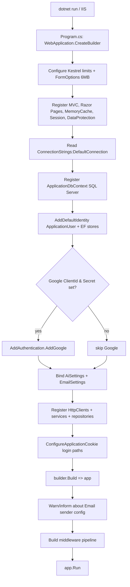
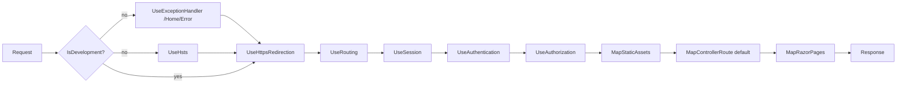
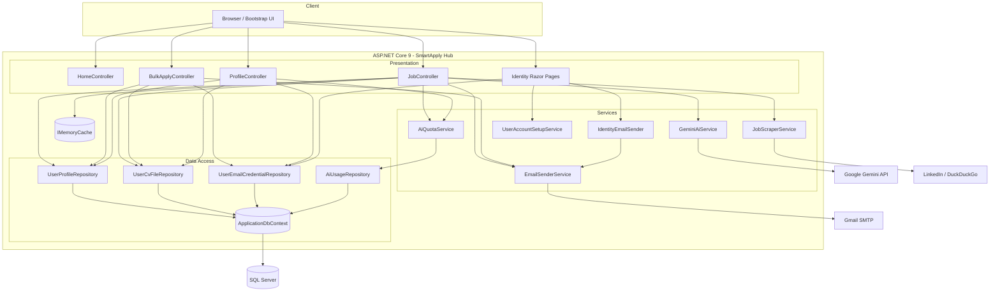

# 01 – Project Overview

> Product name: **SmartApply Hub** (assembly/project name: `JobApplicationBot`)
> Tagline: *AI-powered job applications, tailored to you*

## Table of Contents

- [1. Project Purpose](#1-project-purpose)
- [2. Solution Architecture](#2-solution-architecture)
- [3. Projects Inside the Solution](#3-projects-inside-the-solution)
- [4. Folder Structure](#4-folder-structure)
- [5. Responsibilities of Each Area](#5-responsibilities-of-each-area)
- [6. Startup Flow](#6-startup-flow)
- [7. Program.cs Walkthrough](#7-programcs-walkthrough)
- [8. Dependency Injection Registrations](#8-dependency-injection-registrations)
- [9. Middleware Pipeline](#9-middleware-pipeline)
- [10. Technologies Used](#10-technologies-used)
- [11. External Integrations](#11-external-integrations)
- [12. Configuration Files](#12-configuration-files)
- [13. Logging](#13-logging)
- [14. Error Handling](#14-error-handling)
- [15. Overall Architecture Diagram](#15-overall-architecture-diagram)

---

## 1. Project Purpose

SmartApply Hub is a web application that helps job seekers apply to positions faster using AI. A signed-in user can:

1. **Analyze a job** (by pasting a URL or the raw description) — the app scrapes/reads the description and uses Google Gemini to extract structured details (title, company, contact email, skills, responsibilities).
2. **Generate a tailored application email** with Gemini, based on the extracted job details plus the user's stored profile.
3. **Preview & send** the email (with the user's CV attached) to the job's contact email.
4. **Bulk apply** — send the same application email + CV to many recipient addresses at once, using the user's own Gmail account.
5. **Search jobs** — scrape LinkedIn job postings and LinkedIn "hiring" posts (via DuckDuckGo) for a title in Egypt.
6. Manage a **profile**, **CV file**, **personal Gemini API key**, and **Gmail App Password**.

A freemium **AI quota** (default 20 analyses/month) is enforced per user; supplying a personal Gemini API key bypasses the quota.

## 2. Solution Architecture

This is a **single-project, monolithic ASP.NET Core 9.0 web application** using the **MVC pattern** for the main app and **Razor Pages** for the ASP.NET Core Identity account UI. Internally it follows a **layered architecture**:

```
Presentation (Controllers + Razor Views + Identity Razor Pages)
        │
Application / Domain services (Services/*)
        │
Data access (Repositories + EF Core DbContext)
        │
SQL Server database
```

There is **no separate class library project**; all layers live in one project separated by folders/namespaces. See [12-architecture.md](12-architecture.md).

## 3. Projects Inside the Solution

| Project | Type | Target Framework | Description |
|---|---|---|---|
| `JobApplicationBot` | ASP.NET Core Web App (MVC + Razor Pages) | `net9.0` | The only project. Product name `SmartApply Hub`. |

> There is exactly **one** project. The solution is a single-project monolith.

## 4. Folder Structure

```text
JobApplicationBot/
├── Program.cs                      # App entry point, DI, middleware pipeline
├── JobApplicationBot.csproj        # SDK-style project + NuGet packages
├── appsettings.json                # Base configuration
├── appsettings.Development.json    # Dev overrides (contains dev SMTP secret)
├── Properties/launchSettings.json  # Local run profiles / ports
│
├── Controllers/
│   ├── HomeController.cs
│   ├── JobController.cs
│   ├── BulkApplyController.cs
│   └── ProfileController.cs
│
├── Services/
│   ├── GeminiService.cs            # IAiService + GeminiAiService
│   ├── JobScraperService.cs        # IJobScraperService + JobScraperService
│   ├── EmailSenderService.cs       # IEmailSenderService + records
│   ├── IdentityEmailSender.cs      # IEmailSender<ApplicationUser>
│   ├── UserAccountSetupService.cs  # IUserAccountSetupService
│   └── Quota/
│       ├── IAiQuotaService.cs      # IAiQuotaService + QuotaCheckResult
│       └── AiQuotaService.cs
│
├── Data/
│   ├── ApplicationDbContext.cs
│   ├── EncryptedStringConverter.cs
│   ├── Entities/
│   │   ├── ApplicationUser.cs
│   │   ├── UserProfile.cs
│   │   ├── UserCvFile.cs
│   │   ├── UserEmailCredential.cs
│   │   └── AiUsage.cs
│   └── Repositories/
│       ├── IUserProfileRepository.cs / UserProfileRepository.cs
│       ├── IUserCvFileRepository.cs / UserCvFileRepository.cs
│       ├── IUserEmailCredentialRepository.cs / UserEmailCredentialRepository.cs
│       └── IAiUsageRepository.cs / AiUsageRepository.cs
│
├── Models/                         # View models, settings, DTOs, branding
│   ├── AppSettings.cs              # AiSettings + EmailSettings
│   ├── AppBranding.cs
│   ├── JobInput.cs
│   ├── JobAnalysisResult.cs
│   ├── EmailPreviewModel.cs
│   ├── ProfileViewModel.cs
│   ├── BulkApplyViewModel.cs
│   ├── JobSearchViewModel.cs
│   ├── JobSearchFilter.cs
│   ├── JobSearchResultItem.cs
│   └── ErrorViewModel.cs
│
├── Areas/Identity/Pages/Account/   # Scaffolded Identity Razor Pages
│   ├── Login, Register, ConfirmEmail, ForgotPassword, ResetPassword,
│   ├── ResendEmailConfirmation, RegisterConfirmation, *Confirmation ...
│   └── _ViewImports.cshtml / _ViewStart.cshtml
│
├── Views/                          # MVC Razor views
│   ├── Home/ (Index, Privacy)
│   ├── Job/ (Index, Preview, Success, Search)
│   ├── BulkApply/ (Index)
│   ├── Profile/ (Index)
│   └── Shared/ (_Layout, _LoginPartial, Error, _ValidationScriptsPartial)
│
└── Migrations/                     # EF Core migrations + model snapshot
```

## 5. Responsibilities of Each Area

| Area | Responsibility |
|---|---|
| `Controllers/` | MVC entry points. Handle HTTP, model binding, validation orchestration, call services/repositories, return views. |
| `Services/` | Business logic and integrations (AI, scraping, email sending, account setup, quota). |
| `Data/Entities/` | EF Core entity classes mapped to database tables. |
| `Data/Repositories/` | Data-access abstraction over `ApplicationDbContext` (one repository per aggregate). |
| `Data/ApplicationDbContext.cs` | EF Core context extending `IdentityDbContext<ApplicationUser>`; model configuration + encryption converters. |
| `Models/` | View models, request/response DTOs, options classes, branding constants. |
| `Areas/Identity/` | ASP.NET Core Identity account management (register, login, email confirm, password reset). |
| `Views/` | Server-rendered Razor UI (Bootstrap 5). |
| `Migrations/` | EF Core schema migrations. |

## 6. Startup Flow



> **Note:** `Program.cs` does **not** call `db.Database.Migrate()` — migrations must be applied manually (`dotnet ef database update`). See [08-configuration.md](08-configuration.md).

## 7. Program.cs Walkthrough

Key sections of `Program.cs` (top to bottom):

1. **Request size limits** — `MaxRequestBodyBytes = 6 MB` (5 MB CV + multipart overhead). Applied to both Kestrel (`MaxRequestBodySize`) and MVC `FormOptions`.
2. **Framework services** — `AddControllersWithViews().AddSessionStateTempDataProvider()`, `AddRazorPages()`, `AddMemoryCache()`, `AddSession()`, `AddDataProtection()`.
3. **Database** — reads `ConnectionStrings:DefaultConnection` (throws if missing) and registers `ApplicationDbContext` on SQL Server.
4. **Identity** — `AddDefaultIdentity<ApplicationUser>` with: `RequireConfirmedAccount = true`, password min length 8, non-alphanumeric not required, unique email required. Backed by EF stores.
5. **Google auth (optional)** — only registered when both `Authentication:Google:ClientId` and `ClientSecret` are non-empty.
6. **Options binding** — `AiSettings` from `Ai` section, `EmailSettings` from `Email` section.
7. **App services & repositories** — see [Section 8](#8-dependency-injection-registrations).
8. **Cookie paths** — login/logout/access-denied paths point to Identity pages.
9. **Startup diagnostics** — logs a warning if `Email:SenderEmail`/`Email:SenderPassword` are not both set, otherwise logs info.
10. **Middleware pipeline** — see [Section 9](#9-middleware-pipeline).

## 8. Dependency Injection Registrations

| Service / Interface | Implementation | Lifetime | Notes |
|---|---|---|---|
| `ApplicationDbContext` | — | Scoped | SQL Server via `AddDbContext` |
| `IdentityUser` stack (`UserManager`, `SignInManager`, etc.) | Default Identity | Scoped | `AddDefaultIdentity<ApplicationUser>` |
| `IJobScraperService` | `JobScraperService` | Transient (typed `HttpClient`) | `AddHttpClient<>` |
| `IAiService` | `GeminiAiService` | Transient (typed `HttpClient`) | `AddHttpClient<>` |
| `IEmailSenderService` | `EmailSenderService` | Scoped | |
| `IEmailSender<ApplicationUser>` | `IdentityEmailSender` | Transient | Used by Identity for confirm/reset emails |
| `IUserAccountSetupService` | `UserAccountSetupService` | Scoped | |
| `IUserProfileRepository` | `UserProfileRepository` | Scoped | |
| `IUserCvFileRepository` | `UserCvFileRepository` | Scoped | |
| `IUserEmailCredentialRepository` | `UserEmailCredentialRepository` | Scoped | |
| `IAiUsageRepository` | `AiUsageRepository` | Scoped | |
| `IAiQuotaService` | `AiQuotaService` | Scoped | |
| `IMemoryCache` | built-in | Singleton | `AddMemoryCache()` — used for job search caching |

Options: `AiSettings` (`Ai` section), `EmailSettings` (`Email` section).

## 9. Middleware Pipeline

Order as registered in `Program.cs`:



- Default MVC route: `{controller=Home}/{action=Index}/{id?}`.
- Static assets served through .NET 9 `MapStaticAssets` / `WithStaticAssets`.
- In **Development**, the developer exception page is used (the `UseExceptionHandler`/`UseHsts` block is skipped).

## 10. Technologies Used

| Category | Technology |
|---|---|
| Runtime / Framework | .NET 9.0, ASP.NET Core (MVC + Razor Pages) |
| Language | C# (nullable enabled, implicit usings) |
| ORM | Entity Framework Core 9.0 (SQL Server provider) |
| Database | SQL Server (LocalDB by default) |
| Identity / Auth | ASP.NET Core Identity, cookie auth, optional Google OAuth |
| Data protection | `Microsoft.AspNetCore.DataProtection` (encrypts stored secrets) |
| Email | MailKit 4.15.0 + MimeKit 4.15.0 (SMTP) |
| HTML parsing / scraping | HtmlAgilityPack 1.12.4 |
| AI | Google Gemini REST API (also supports OpenAI-compatible endpoints) |
| Caching | In-memory (`IMemoryCache`) |
| UI | Razor views, Bootstrap 5.3.3, Bootstrap Icons (CDN) |

Full package list: see [dependency-map.md](dependency-map.md).

## 11. External Integrations

| Integration | Used By | Purpose |
|---|---|---|
| Google Gemini API (`generativelanguage.googleapis.com`) | `GeminiAiService` | Job analysis + email generation |
| OpenAI-compatible LLM endpoints (optional) | `GeminiAiService` | Alternate LLM if `Ai:BaseUrl` is not a Google host |
| LinkedIn guest jobs API | `JobScraperService` | Job search results |
| DuckDuckGo HTML (`html.duckduckgo.com`) | `JobScraperService` | LinkedIn "hiring" posts search |
| Arbitrary job URLs | `JobScraperService` | Scrape a single job description |
| Gmail SMTP (`smtp.gmail.com:587`) | `EmailSenderService` | Send application/bulk/identity emails |
| Google OAuth (optional) | Identity | External login |

## 12. Configuration Files

| File | Purpose |
|---|---|
| `appsettings.json` | Base config: logging, connection string, `Ai`, `Email`, `Authentication:Google`. |
| `appsettings.Development.json` | Dev overrides: logging + `Email` (includes a dev Gmail App Password). |
| `Properties/launchSettings.json` | Local profiles: `http` (5210), `https` (7039/5210), IIS Express. |

Detailed reference: [08-configuration.md](08-configuration.md).

> ⚠️ **Secret-in-repo warning:** `appsettings.json` contains an `Ai:ApiKey` value and `appsettings.Development.json` contains a live Gmail App Password. See [code-quality.md](code-quality.md) and [07-security.md](07-security.md).

## 13. Logging

- Uses the **default ASP.NET Core logging** (`ILogger<T>`), configured via the `Logging` section (Default `Information`, `Microsoft.AspNetCore` `Warning`).
- Explicit logging occurs in: `EmailSenderService` (email sent), `IdentityEmailSender` path, Identity pages (`LoginModel`, `ForgotPasswordModel`), and `Program.cs` startup diagnostics for email config.
- No third-party logging provider (Serilog, etc.) is configured.

## 14. Error Handling

- **Production:** `UseExceptionHandler("/Home/Error")` + HSTS. (Note: `HomeController` has no `Error` action; the `/Home/Error` route relies on the shared `Views/Shared/Error.cshtml` — see [code-quality.md](code-quality.md).)
- **Development:** default developer exception page.
- **Controller-level:** `JobController.Analyze/Send/Search` and `BulkApplyController.Send` wrap external calls in `try/catch` and surface `ex.Message` into `ModelState` or per-recipient results.
- **Service-level:** `GeminiAiService` throws `Exception`/`InvalidOperationException` on API failures; `JobScraperService` swallows fetch failures and returns empty lists.

See [12-architecture.md](12-architecture.md#exception-handling-strategy) for the full strategy.

## 15. Overall Architecture Diagram



---

_See also: [02-business-domain.md](02-business-domain.md), [12-architecture.md](12-architecture.md), [AI_CONTEXT.md](AI_CONTEXT.md)._
