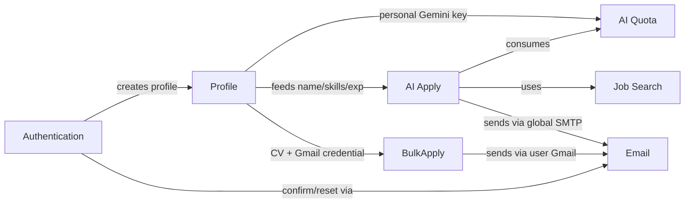
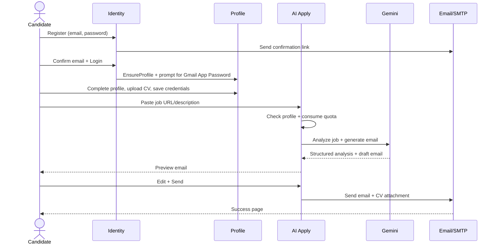

# 02 – Business Domain

> Onboarding guide for a new backend developer. Everything here is derived from the actual code — nothing is assumed.

## Table of Contents

- [1. Business Purpose](#1-business-purpose)
- [2. Main Business Modules](#2-main-business-modules)
- [3. User Roles](#3-user-roles)
- [4. Permissions](#4-permissions)
- [5. Business Workflows](#5-business-workflows)
- [6. Approval Workflows](#6-approval-workflows)
- [7. Core Entities](#7-core-entities)
- [8. Business Rules](#8-business-rules)
- [9. Relationships Between Modules](#9-relationships-between-modules)
- [10. End-to-End Business Process](#10-end-to-end-business-process)
- [11. Real System Behavior](#11-real-system-behavior)

---

## 1. Business Purpose

SmartApply Hub reduces the time and effort of applying to jobs. Instead of manually writing a tailored email for every posting, a candidate:

- stores their profile and CV once,
- lets AI read a job posting and draft a personalized application email,
- reviews and sends it (with CV attached), or
- blasts the same tailored application to many recipients at once.

The business model is **freemium**: each user gets a fixed number of free AI analyses per month (default **20**). Beyond that, they must add their own Google Gemini API key to keep using AI features.

## 2. Main Business Modules

| Module | Entry Point | Description |
|---|---|---|
| **Authentication & Account** | `Areas/Identity/*`, `HomeController` | Register, confirm email, login, logout, password reset, optional Google login. |
| **Profile** | `ProfileController` | Manage personal details, CV upload/download, personal Gemini key, Gmail sender credential. |
| **AI Apply (single)** | `JobController` | Analyze one job, generate an email, preview, send to the job's contact. |
| **Bulk Apply** | `BulkApplyController` | Send the application email + CV to up to 500 recipients using the user's own Gmail. |
| **Job Search** | `JobController.Search` | Search LinkedIn jobs + LinkedIn hiring posts by title (Egypt). |
| **AI Quota / Freemium** | `AiQuotaService` | Enforce monthly free-usage limits; bypassed by a personal API key. |

## 3. User Roles

- The application uses ASP.NET Core Identity. The Identity **role tables exist** in the schema (`AspNetRoles`, `AspNetUserRoles`, etc.), **but no roles are defined, seeded, assigned, or checked anywhere in the code.**
- Effective roles today:

| Role | Meaning | How enforced |
|---|---|---|
| **Anonymous / Guest** | Not signed in | Can only see the landing page (`Home/Index`) and Identity pages. |
| **Authenticated User** | Signed in + confirmed email | Full access to Job, BulkApply, Profile features. |

> There is **no Admin role** and **no role-based authorization** in the current codebase.

## 4. Permissions

Authorization is **coarse-grained** and identity-based, not permission/claim-based:

- All feature controllers (`JobController`, `BulkApplyController`, `ProfileController`) are annotated `[Authorize]` → require an authenticated user.
- `HomeController` is anonymous (redirects authenticated users to the Job page).
- Identity pages are `[AllowAnonymous]`.
- Data is **scoped by the current user id** (`ClaimTypes.NameIdentifier`) inside each controller — a user can only read/write their own profile, CV, credential, and usage rows. There is no cross-user access path.

No custom policies, claims, or permission tables are used. See [07-security.md](07-security.md).

## 5. Business Workflows

### 5.1 Sign up & first-run
1. User registers (email + password ≥ 8 chars).
2. `UserAccountSetupService.EnsureProfileAsync` creates a `UserProfile` row pre-filled with the contact email.
3. A confirmation email is sent; the account **cannot log in until confirmed** (`RequireConfirmedAccount = true`).
4. On first login, if the user has **no Gmail App Password** saved, they are redirected to Profile with a prompt.

### 5.2 Complete profile
- User fills FullName (required), Title, Phone, ContactEmail, SkillsSummary, ExperienceSummary.
- Optionally uploads a CV (`.pdf/.doc/.docx`, ≤ 5 MB), a personal Gemini key, and a Gmail sender + App Password.

### 5.3 AI Apply (single job)
1. User pastes a job URL or description.
2. Profile must be complete enough (has `FullName`) → otherwise redirected to Profile.
3. **Quota is consumed** (unless personal key present).
4. Description is scraped (if URL) → Gemini analyzes → Gemini drafts email → preview shown.
5. User edits & sends → email sent via **global SMTP** with CV attached → success page.

### 5.4 Bulk Apply
1. User enters up to 50 recipient emails.
2. Prerequisites: complete profile (name+title+skills+experience), CV on file, saved Gmail App Password.
3. Auto or custom subject/body → sent **from the user's own Gmail** one recipient at a time; per-recipient success/failure recorded.

### 5.5 Job Search
1. User enters a job title (+ optional experience level, date-posted filter).
2. App scrapes LinkedIn jobs + LinkedIn posts (Egypt) → merged, cached 15 min, paged (10/page).

## 6. Approval Workflows

**There are no approval workflows** in the system. No entity has an approval/review status, no multi-step sign-off, no manager/admin approval. Email sending is direct and immediate; the only "review" step is the user previewing their own generated email before pressing Send (single Apply flow).

## 7. Core Entities

| Entity | Table | Business meaning |
|---|---|---|
| `ApplicationUser` | `AspNetUsers` | The account/identity of a candidate. |
| `UserProfile` | `UserProfiles` | Candidate's CV-style profile + optional personal Gemini key. 1:1 with user. |
| `UserCvFile` | `UserCvFiles` | The candidate's CV binary stored in DB. 1:1 with user. |
| `UserEmailCredential` | `UserEmailCredentials` | Candidate's Gmail sender + encrypted App Password for bulk send. 1:1 with user. |
| `AiUsage` | `AiUsages` | Per-user, per-month AI call counter (freemium quota). 1:many with user. |

Full schema: [03-database.md](03-database.md).

## 8. Business Rules

Rules extracted directly from code:

- **BR-1 (Email confirmation required):** Users cannot sign in until they confirm their email (`options.SignIn.RequireConfirmedAccount = true`).
- **BR-2 (Unique email):** Emails are unique (`options.User.RequireUniqueEmail = true`).
- **BR-3 (Password policy):** Min length 8, no non-alphanumeric requirement.
- **BR-4 (Profile gate for AI Apply):** Analyze requires a profile with a non-empty `FullName`; else redirect to Profile. (`JobController.GetOrPromptProfileAsync`)
- **BR-5 (Freemium quota):** Without a personal Gemini key, a user may run `Ai:FreeQuotaPerMonth` (default 20) analyses per calendar month (UTC). Quota is consumed atomically **before** the AI call. (`AiQuotaService.TryConsumeAsync`)
- **BR-6 (Personal key bypass):** A non-empty `UserProfile.PersonalGeminiApiKey` bypasses the quota entirely and is used as the API key. (`AiQuotaService`, `JobController.Analyze`)
- **BR-7 (Bulk prerequisites):** Bulk apply requires: complete profile (FullName+Title+SkillsSummary+ExperienceSummary), a CV on file, and a saved Gmail App Password. (`BulkApplyController.ValidatePrerequisites`)
- **BR-8 (Bulk recipient cap):** Max **500** recipients per bulk send; duplicates removed (case-insensitive); each must be a valid email. (`BulkApplyViewModel.MaxRecipients`, `ValidateRecipients`)
- **BR-9 (CV constraints):** Allowed extensions `.pdf/.doc/.docx`; max size **5 MB**. (`ProfileController`)
- **BR-10 (Request size cap):** Whole request body capped at **6 MB**. (`Program.cs`)
- **BR-11 (Secret encryption):** `PersonalGeminiApiKey` and Gmail `Secret` are stored **encrypted** via DataProtection. (`EncryptedStringConverter`)
- **BR-12 (Single Apply sender):** Single Apply sends from the **global** configured SMTP sender; Bulk Apply sends from the **user's own** Gmail credential.
- **BR-13 (Search default location):** Job search is hardcoded to location **"Egypt"**. (`JobScraperService.DefaultLocation`)
- **BR-14 (Search cache):** Search results are cached for **15 minutes** keyed by `{userId}:{guid}`; paging is 10 results/page.

## 9. Relationships Between Modules

- **Profile is the hub**: nearly every feature reads from it.
- **AI Apply depends on Quota** and the AI + scraper + email modules.
- **Bulk Apply depends on CV + user's Gmail credential**.
- **Search is standalone** (does not touch the database).

## 10. End-to-End Business Process

## 11. Real System Behavior

Practical notes a developer should know:

- **Quota is consumed even if the later AI call fails.** `TryConsumeAsync` increments the counter before analysis; if Gemini errors afterward, the attempt still counted. (See [code-quality.md](code-quality.md).)
- **Single Apply email `ToEmail`** is auto-filled from the AI-extracted `contactEmail`, which may be empty if the posting had none — the user can type it in the preview.
- **Bulk Apply is best-effort per recipient**: one failure does not stop the batch; each recipient gets a Success/Message row.
- **Job Search can silently return fewer/no results** — scraping failures are swallowed and return empty lists (LinkedIn/DuckDuckGo may block or change markup).
- **Google login only appears if configured**; otherwise only email/password is available.
- **No data is ever shared across users**; all queries filter by the authenticated user's id.

---

_See also: [09-business-flows.md](09-business-flows.md) and the per-feature docs in [features/](features/)._
