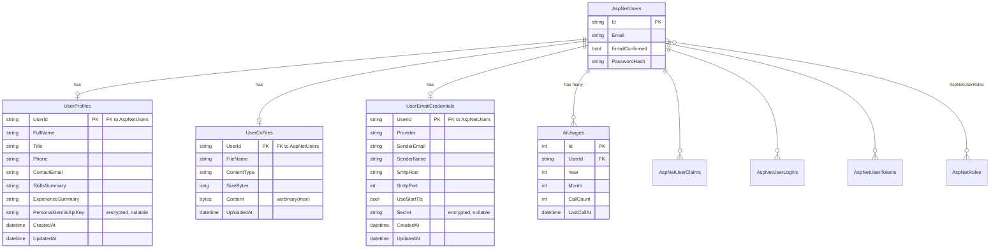

# 03 – Database

> Source of truth: `Data/Entities/*`, `Data/ApplicationDbContext.cs`, `Migrations/ApplicationDbContextModelSnapshot.cs`. Provider: **SQL Server** (EF Core 9).

## Table of Contents

- [1. Overview](#1-overview)
- [2. Entities & Tables](#2-entities--tables)
- [3. Application Tables (detail)](#3-application-tables-detail)
- [4. ASP.NET Identity Tables](#4-aspnet-identity-tables)
- [5. Relationships](#5-relationships)
- [6. ER Diagram](#6-er-diagram)
- [7. Entity Framework Configuration](#7-entity-framework-configuration)
- [8. Audit Fields](#8-audit-fields)
- [9. Soft Delete Logic](#9-soft-delete-logic)
- [10. Indexes](#10-indexes)
- [11. Encryption at Rest](#11-encryption-at-rest)
- [12. Migrations](#12-migrations)
- [13. Database Conventions](#13-database-conventions)

---

## 1. Overview

`ApplicationDbContext` extends `IdentityDbContext<ApplicationUser>`, so the schema is the union of:

- **ASP.NET Core Identity tables** (`AspNetUsers`, `AspNetRoles`, `AspNetUserClaims`, `AspNetUserLogins`, `AspNetUserRoles`, `AspNetUserTokens`, `AspNetRoleClaims`), and
- **Four application tables**: `UserProfiles`, `UserCvFiles`, `UserEmailCredentials`, `AiUsages`.

The default database name is `JobApplicationBot` on `(localdb)\MSSQLLocalDB`.

## 2. Entities & Tables

| Entity class | Table | Primary Key | Cardinality to User |
|---|---|---|---|
| `ApplicationUser` | `AspNetUsers` | `Id` (nvarchar(450)) | — |
| `UserProfile` | `UserProfiles` | `UserId` (PK+FK) | 1 : 1 |
| `UserCvFile` | `UserCvFiles` | `UserId` (PK+FK) | 1 : 1 |
| `UserEmailCredential` | `UserEmailCredentials` | `UserId` (PK+FK) | 1 : 1 |
| `AiUsage` | `AiUsages` | `Id` (int identity) | 1 : many |

## 3. Application Tables (detail)

### 3.1 `UserProfiles`

| Column | Type | Nullable | Notes |
|---|---|---|---|
| `UserId` | nvarchar(450) | No | **PK + FK** → `AspNetUsers.Id`, cascade delete |
| `FullName` | nvarchar(200) | No (required) | Default `''` |
| `Title` | nvarchar(200) | No | |
| `Phone` | nvarchar(50) | No | |
| `ContactEmail` | nvarchar(256) | No | Shown in application emails |
| `SkillsSummary` | nvarchar(2000) | No | |
| `ExperienceSummary` | nvarchar(4000) | No | |
| `BulkTemplateSubject` | nvarchar(300) | Yes | Saved Bulk Apply subject |
| `BulkTemplateBody` | nvarchar(5000) | Yes | Saved Bulk Apply body |
| `PersonalGeminiApiKey` | nvarchar(2000) | Yes | **Encrypted** at rest |
| `CreatedAt` | datetime2 | No | Set on insert (UTC) |
| `UpdatedAt` | datetime2 | No | Set on every upsert (UTC) |

### 3.2 `UserCvFiles`

| Column | Type | Nullable | Notes |
|---|---|---|---|
| `UserId` | nvarchar(450) | No | **PK + FK** → `AspNetUsers.Id`, cascade delete |
| `FileName` | nvarchar(255) | No (required) | |
| `ContentType` | nvarchar(100) | No (required) | Default `application/octet-stream` |
| `SizeBytes` | bigint | No | |
| `Content` | varbinary(max) | No (required) | The CV bytes |
| `UploadedAt` | datetime2 | No | UTC |

### 3.3 `UserEmailCredentials`

| Column | Type | Nullable | Notes |
|---|---|---|---|
| `UserId` | nvarchar(450) | No | **PK + FK** → `AspNetUsers.Id`, cascade delete |
| `Provider` | nvarchar(50) | No (required) | Default `GmailSmtp` |
| `SenderEmail` | nvarchar(256) | No (required) | `[EmailAddress]` |
| `SenderName` | nvarchar(200) | No (required) | |
| `SmtpHost` | nvarchar(200) | No (required) | Default `smtp.gmail.com` |
| `SmtpPort` | int | No | Default `587` |
| `UseStartTls` | bit | No | Default `true` |
| `Secret` | nvarchar(2000) | Yes | Gmail **App Password**, **encrypted** at rest |
| `CreatedAt` | datetime2 | No | UTC |
| `UpdatedAt` | datetime2 | No | UTC |

### 3.4 `AiUsages`

| Column | Type | Nullable | Notes |
|---|---|---|---|
| `Id` | int (identity) | No | **PK** |
| `UserId` | nvarchar(450) | No (required) | **FK** → `AspNetUsers.Id`, cascade delete |
| `Year` | int | No | Calendar year (UTC) |
| `Month` | int | No | Calendar month (UTC) |
| `CallCount` | int | No | AI analyses used that month |
| `LastCallAt` | datetime2 | No | UTC |

Unique index on `(UserId, Year, Month)` — one row per user per month.

## 4. ASP.NET Identity Tables

Standard Identity schema (unchanged from defaults). `ApplicationUser` adds a navigation property `Profile` but **no extra columns**. Key Identity columns used by the app: `Id`, `Email`, `EmailConfirmed`, `NormalizedEmail`, `PasswordHash`, `SecurityStamp`.

| Table | Purpose |
|---|---|
| `AspNetUsers` | Accounts |
| `AspNetRoles` | Roles (unused by app logic) |
| `AspNetUserRoles` | User-role links (unused) |
| `AspNetUserClaims` | User claims |
| `AspNetUserLogins` | External logins (e.g. Google) |
| `AspNetUserTokens` | Tokens (email confirm, reset) |
| `AspNetRoleClaims` | Role claims (unused) |

## 5. Relationships

- `ApplicationUser` **1 ─ 1** `UserProfile` (via `UserProfile.UserId`, `ApplicationUser.Profile` navigation).
- `ApplicationUser` **1 ─ 1** `UserCvFile` (no reverse navigation).
- `ApplicationUser` **1 ─ 1** `UserEmailCredential` (no reverse navigation).
- `ApplicationUser` **1 ─ * ** `AiUsage`.
- All FKs use `OnDelete(DeleteBehavior.Cascade)` — deleting a user removes all their app rows.

## 6. ER Diagram

## 7. Entity Framework Configuration

Configuration lives in `ApplicationDbContext.OnModelCreating`:

- **`UserProfile`**: 1:1 with `ApplicationUser` via `HasOne(p => p.User).WithOne(u => u.Profile).HasForeignKey<UserProfile>(p => p.UserId)`, cascade delete. `PersonalGeminiApiKey` gets `EncryptedStringConverter` **only when** an `IDataProtectionProvider` is available.
- **`AiUsage`**: 1:many via `HasOne(u => u.User).WithMany()`, cascade delete. Unique index `IX_AiUsages_User_Year_Month`.
- **`UserCvFile`**: 1:1 via `WithOne()` (no reverse nav), cascade delete. `Content` mapped to `varbinary(max)`.
- **`UserEmailCredential`**: 1:1 via `WithOne()`, cascade delete. `Secret` gets `EncryptedStringConverter` when DataProtection is available.

Attribute-based config on entities: `[Key]`, `[ForeignKey]`, `[MaxLength]`, `[Required]`, `[EmailAddress]`.

## 8. Audit Fields

There is **no global/automatic auditing**. Audit-like fields exist per entity and are set **manually in the repositories**:

| Entity | Fields | Where set |
|---|---|---|
| `UserProfile` | `CreatedAt`, `UpdatedAt` | `UserProfileRepository.UpsertAsync` |
| `UserEmailCredential` | `CreatedAt`, `UpdatedAt` | `UserEmailCredentialRepository.UpsertAsync` |
| `UserCvFile` | `UploadedAt` | `UserCvFileRepository.UpsertAsync` |
| `AiUsage` | `LastCallAt` | `AiUsageRepository` |

There is no `CreatedBy`/`ModifiedBy` and no interceptor/`SaveChanges` override for auditing.

## 9. Soft Delete Logic

**There is no soft delete.** No `IsDeleted`/`DeletedAt` flags and no global query filters. Deletes are **hard deletes**:
- `UserCvFileRepository.DeleteAsync` and `UserEmailCredentialRepository.DeleteAsync` physically remove rows.
- User deletion cascades to all child app rows via FK cascade.

## 10. Indexes

| Table | Index | Type | Purpose |
|---|---|---|---|
| `AiUsages` | `IX_AiUsages_User_Year_Month` (`UserId`,`Year`,`Month`) | Unique | One usage row per user/month; supports quota lookups + concurrency guard |
| `AspNetUsers` | `EmailIndex` (`NormalizedEmail`) | Non-unique | Identity default |
| `AspNetUsers` | `UserNameIndex` (`NormalizedUserName`) | Unique (filtered) | Identity default |
| `AspNetRoles` | `RoleNameIndex` | Unique (filtered) | Identity default |
| Identity link tables | FK indexes | Non-unique | Identity default |

PKs (`UserId` on the 1:1 app tables) are clustered by default. No additional custom indexes exist on the app tables.

## 11. Encryption at Rest

Two columns are transparently encrypted using `EncryptedStringConverter` (backed by ASP.NET Core DataProtection, purpose `JobApplicationBot.UserSecret.v1`):

- `UserProfiles.PersonalGeminiApiKey`
- `UserEmailCredentials.Secret` (Gmail App Password)

> The converter is only wired up when an `IDataProtectionProvider` is injected. If the context is created **without** DataProtection (e.g. design-time migrations), these values are stored as plaintext. See [07-security.md](07-security.md) and [code-quality.md](code-quality.md).

## 12. Migrations

Located in `Migrations/`:

| Migration | Adds |
|---|---|
| `20260601081636_InitialIdentityAndProfile` | Identity tables + `UserProfiles` + `AiUsages` |
| `20260601084422_StoreCvInDb` | `UserCvFiles` |
| `20260604071141_AddUserEmailCredentialForBulkApply` | `UserEmailCredentials` |

Apply with `dotnet ef database update`. **Migrations are not auto-applied at startup.**

## 13. Database Conventions

- **1:1 tables use the FK as the PK** (`UserId` is both PK and FK) — enforces exactly one row per user.
- **UTC timestamps** everywhere (`DateTime.UtcNow`).
- **`[MaxLength]` on all string columns** to avoid `nvarchar(max)` (except identity defaults and the CV blob).
- **Reads use `AsNoTracking()`** in repositories; writes fetch a tracked entity then update.
- **Cascade delete** from `AspNetUsers` to all app tables.
- Table names are the **DbSet property names** (pluralized) — `UserProfiles`, `UserCvFiles`, `UserEmailCredentials`, `AiUsages`.

---

_See also: [06-data-access.md](06-data-access.md) for repository queries and concurrency handling._
