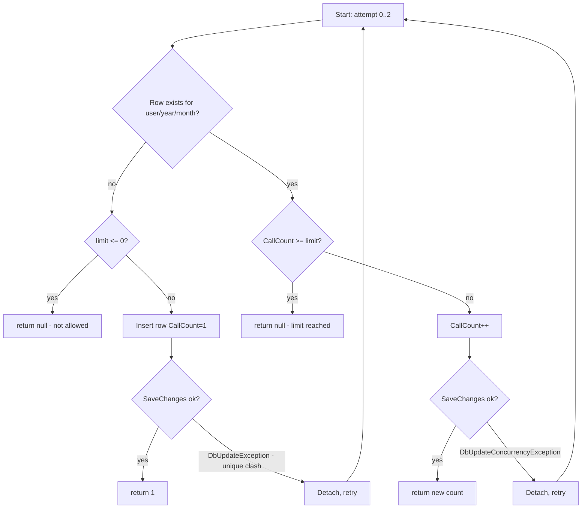

# 06 – Data Access

> Location: `Data/Repositories/`, `Data/ApplicationDbContext.cs`. ORM: EF Core 9 (SQL Server).

## Table of Contents

- [1. Approach](#1-approach)
- [2. Repository Pattern](#2-repository-pattern)
- [3. Generic Repository](#3-generic-repository)
- [4. Custom Repositories](#4-custom-repositories)
- [5. Unit of Work](#5-unit-of-work)
- [6. LINQ Queries](#6-linq-queries)
- [7. Stored Procedures](#7-stored-procedures)
- [8. Transactions](#8-transactions)
- [9. Concurrency Handling](#9-concurrency-handling)
- [10. Performance Considerations](#10-performance-considerations)

---

## 1. Approach

Data access uses a **thin, hand-written repository per aggregate** over EF Core. There is **no generic repository** and **no explicit Unit of Work** — each repository injects `ApplicationDbContext` and calls `SaveChangesAsync` itself. Repositories are registered **Scoped** so they share the request's `DbContext`.

## 2. Repository Pattern

Four repositories, each with an interface + implementation:

| Interface | Implementation | Aggregate |
|---|---|---|
| `IUserProfileRepository` | `UserProfileRepository` | `UserProfile` |
| `IUserCvFileRepository` | `UserCvFileRepository` | `UserCvFile` |
| `IUserEmailCredentialRepository` | `UserEmailCredentialRepository` | `UserEmailCredential` |
| `IAiUsageRepository` | `AiUsageRepository` | `AiUsage` |

Common shape: `GetByUserIdAsync`/`GetAsync` (read, `AsNoTracking`), `UpsertAsync` (insert-or-update), and `DeleteAsync` where relevant.

### Method matrix

| Repository | Read | Write | Delete | Special |
|---|---|---|---|---|
| `UserProfileRepository` | `GetByUserIdAsync` | `UpsertAsync` | — | — |
| `UserCvFileRepository` | `GetAsync`, `GetMetadataAsync` | `UpsertAsync` | `DeleteAsync` | metadata projection avoids loading blob |
| `UserEmailCredentialRepository` | `GetByUserIdAsync` | `UpsertAsync` | `DeleteAsync` | — |
| `AiUsageRepository` | `GetCurrentMonthCountAsync` | `TryIncrementIfBelowLimitAsync` | — | atomic conditional increment |

## 3. Generic Repository

**None.** There is no `IRepository<T>`/`Repository<T>` base class. Each repository is concrete and purpose-built. (Considered a deliberate simplicity trade-off; see [12-architecture.md](12-architecture.md).)

## 4. Custom Repositories

### `UserProfileRepository`
- `GetByUserIdAsync` → `AsNoTracking().FirstOrDefaultAsync(p => p.UserId == userId)`.
- `UpsertAsync` → loads tracked existing row; if none, sets `CreatedAt`/`UpdatedAt` and adds; else copies scalar fields, conditionally updates `PersonalGeminiApiKey` (only when non-null; empty → null), sets `UpdatedAt`; then `SaveChangesAsync`.

### `UserCvFileRepository`
- `GetAsync` → full row **including `Content` bytes** (use only for download/send).
- `GetMetadataAsync` → **projection** to `CvFileMetadata(FileName, ContentType, SizeBytes, UploadedAt)` so the `varbinary(max)` blob is not streamed for display.
- `UpsertAsync` / `DeleteAsync` → standard tracked upsert/remove.

### `UserEmailCredentialRepository`
- Mirrors profile repo. `Secret` updated only when non-null (empty → null).

### `AiUsageRepository`
- `GetCurrentMonthCountAsync` → reads `CallCount` for the current `(UserId, Year, Month)` (UTC) or 0.
- `TryIncrementIfBelowLimitAsync` → see [Concurrency](#9-concurrency-handling).

## 5. Unit of Work

**No dedicated Unit of Work abstraction.** EF Core's `DbContext` itself acts as the unit of work per request. Each repository call is self-contained and commits immediately via `SaveChangesAsync`. There is no cross-repository transactional coordination in the current code.

## 6. LINQ Queries

All queries are LINQ-to-Entities. Examples:

```csharp
// Read (no tracking)
_db.UserProfiles.AsNoTracking().FirstOrDefaultAsync(p => p.UserId == userId, ct);

// Projection to avoid loading the CV blob
_db.UserCvFiles.AsNoTracking()
   .Where(c => c.UserId == userId)
   .Select(c => new CvFileMetadata(c.FileName, c.ContentType, c.SizeBytes, c.UploadedAt))
   .FirstOrDefaultAsync(ct);

// Conditional read for the monthly usage row
_db.AiUsages.FirstOrDefaultAsync(u => u.UserId == userId && u.Year == year && u.Month == month, ct);
```

There are no raw SQL calls (`FromSqlRaw`/`ExecuteSql`).

## 7. Stored Procedures

**None.** The app uses no stored procedures, functions, or views. All access is through EF Core.

## 8. Transactions

No explicit `BeginTransaction`/`TransactionScope`. Each `SaveChangesAsync` is its own implicit transaction. The `ProfileController.Post` action performs up to three separate upserts (CV, profile, credential) that are **not** wrapped in a single transaction — a partial failure could persist some but not all. See [code-quality.md](code-quality.md).

## 9. Concurrency Handling

`AiUsageRepository.TryIncrementIfBelowLimitAsync` implements an **optimistic, retry-based atomic counter** to survive concurrent AI requests from the same user:



- The **unique index** `IX_AiUsages_User_Year_Month` guarantees only one row per user/month, turning a concurrent insert race into a catchable `DbUpdateException`.
- Up to **3 attempts**; returns `null` (not allowed) if it cannot commit.
- Note: the update path relies on `DbUpdateConcurrencyException`, but `AiUsage` has **no concurrency token** (e.g. `RowVersion`), so lost-update races on the increment path are possible under high contention (documented in [code-quality.md](code-quality.md)).

## 10. Performance Considerations

- **`AsNoTracking()`** on all reads → less change-tracking overhead.
- **Metadata projection** (`GetMetadataAsync`) avoids pulling the CV `varbinary(max)` blob for views that only show a filename/size.
- **Blob stored in DB** (`varbinary(max)`): simple but loads the entire CV into memory on download/send; capped at 5 MB per file.
- **`MultipleActiveResultSets=true`** in the connection string allows overlapping reads.
- **Search results cached** in `IMemoryCache` for 15 minutes (in `JobController`, not a repository) to avoid repeated scraping.
- No batching/`AddRange`, no compiled queries, no second-level cache.

---

_See also: [03-database.md](03-database.md) for schema and indexes._
