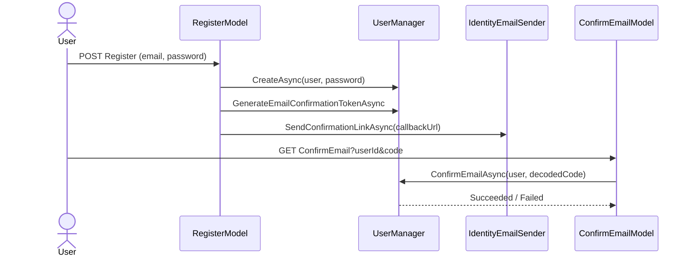
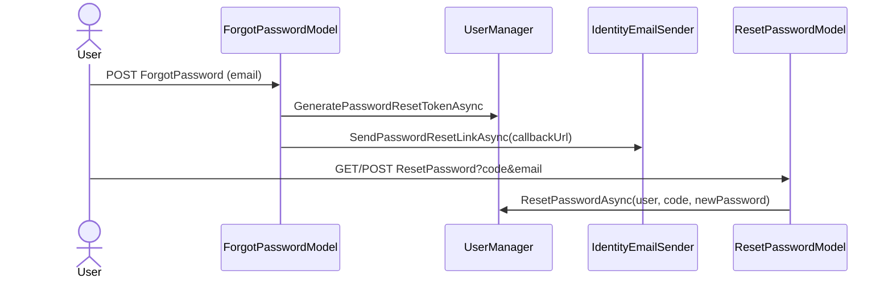

# 07 – Security

> Derived from `Program.cs`, `Areas/Identity/*`, `Data/ApplicationDbContext.cs`, `EncryptedStringConverter.cs`, and controllers.

## Table of Contents

- [1. Summary](#1-summary)
- [2. Authentication](#2-authentication)
- [3. Authorization](#3-authorization)
- [4. JWT](#4-jwt)
- [5. Identity](#5-identity)
- [6. Roles](#6-roles)
- [7. Claims](#7-claims)
- [8. Policies](#8-policies)
- [9. Permission System](#9-permission-system)
- [10. Security Middleware](#10-security-middleware)
- [11. Token Flow](#11-token-flow)
- [12. Secrets & Encryption](#12-secrets--encryption)
- [13. Known Security Concerns](#13-known-security-concerns)

---

## 1. Summary

Authentication is **cookie-based ASP.NET Core Identity** with mandatory email confirmation and optional Google OAuth. Authorization is **coarse**: `[Authorize]` gates all feature controllers; per-user data isolation is enforced in code via the current user id. There is **no JWT**, **no roles in use**, and **no permission/policy system**.

## 2. Authentication

Configured in `Program.cs` via `AddDefaultIdentity<ApplicationUser>`:

- `SignIn.RequireConfirmedAccount = true` — must confirm email before sign-in.
- `Password.RequiredLength = 8`, `Password.RequireNonAlphanumeric = false`.
- `User.RequireUniqueEmail = true`.
- Cookie paths (`ConfigureApplicationCookie`): Login `/Identity/Account/Login`, Logout `/Identity/Account/Logout`, AccessDenied `/Identity/Account/AccessDenied`.
- **Google OAuth** is registered only when both `Authentication:Google:ClientId` and `ClientSecret` are configured.

Sign-in uses `SignInManager.PasswordSignInAsync` (`lockoutOnFailure: false`).

## 3. Authorization

- `[Authorize]` on `JobController`, `BulkApplyController`, `ProfileController`.
- `HomeController` is anonymous.
- Identity pages are `[AllowAnonymous]`.
- `UseAuthentication()` then `UseAuthorization()` in the pipeline.
- **Data-level authorization:** every controller resolves `ClaimTypes.NameIdentifier` and queries only that user's rows. There is no controller/action that accepts another user's id, so horizontal privilege escalation is not exposed through the current endpoints.

## 4. JWT

**Not used.** No `AddJwtBearer`, no token issuance/validation, no bearer auth. Authentication is entirely cookie-based.

## 5. Identity

- Custom user type: `ApplicationUser : IdentityUser` (adds only a `Profile` navigation).
- Store: `AddEntityFrameworkStores<ApplicationDbContext>()`.
- Email delivery for Identity handled by `IdentityEmailSender : IEmailSender<ApplicationUser>` → global SMTP.
- Confirmation and reset tokens are generated by `UserManager` and Base64Url-encoded into callback URLs.

## 6. Roles

- Identity **role tables exist** in the schema but **no role is created, seeded, assigned, or checked** anywhere. There is effectively no role-based access control.

## 7. Claims

- The app relies on the standard Identity claims principal. It reads **only** `ClaimTypes.NameIdentifier` (the user id) in controllers.
- No custom claims are added or transformed.

## 8. Policies

**None.** No `AddAuthorization(options => options.AddPolicy(...))` and no `[Authorize(Policy = ...)]`. Only the default authenticated-user requirement via bare `[Authorize]`.

## 9. Permission System

**None.** There is no permission entity, permission claim, or fine-grained access control. Access is binary: authenticated vs anonymous, plus per-user data scoping.

## 10. Security Middleware

| Concern | Mechanism |
|---|---|
| HTTPS | `UseHttpsRedirection()`; `UseHsts()` in non-development |
| CSRF | `[ValidateAntiForgeryToken]` on all POST actions; Razor forms emit tokens |
| Auth | `UseAuthentication()` + `UseAuthorization()` |
| Session | `UseSession()` (used for TempData provider) |
| Request size | Kestrel `MaxRequestBodySize` + `FormOptions` = 6 MB (mitigates large-upload DoS) |
| Data protection | `AddDataProtection()` (keys + secret encryption) |

## 11. Token Flow

### Email confirmation

### Password reset

- Tokens are opaque Identity tokens, Base64Url-encoded in URLs; the reset code path also `HtmlEncode`s the callback URL.
- `ForgotPassword` does **not** reveal whether an email exists (always redirects to confirmation).

## 12. Secrets & Encryption

- **At rest:** `UserProfiles.PersonalGeminiApiKey` and `UserEmailCredentials.Secret` are encrypted with `EncryptedStringConverter` (DataProtection protector purpose `JobApplicationBot.UserSecret.v1`).
- **Data protection keys:** default key ring (local file system / registry depending on host). No custom key persistence configured — in a multi-instance / container deployment, keys must be shared or encrypted values become unreadable across instances.
- **In transit:** SMTP uses STARTTLS; app served over HTTPS.

## 13. Known Security Concerns

> These are findings, not code changes. Full list in [code-quality.md](code-quality.md).

1. **Secrets committed to source control:** `appsettings.json` contains an `Ai:ApiKey`; `appsettings.Development.json` contains a real Gmail App Password. These should be rotated and moved to user-secrets / environment variables / a vault.
2. **SSRF via scraping:** `JobController.Analyze` fetches an arbitrary user-supplied `JobUrl` server-side (`JobScraperService.ScrapeJobDescriptionAsync`) with no allowlist — could be abused to reach internal endpoints.
3. **DataProtection keys not explicitly persisted/shared:** encrypted secrets may become undecryptable after key ring reset or across scaled instances.
4. **No account lockout:** `lockoutOnFailure: false` on sign-in → brute-force friendly.
5. **No anti-automation on email sending:** bulk send (up to 50/recipients) and single send have no rate limiting beyond the AI quota.

---

_See also: [08-configuration.md](08-configuration.md) and [features/Authentication.md](features/Authentication.md)._
