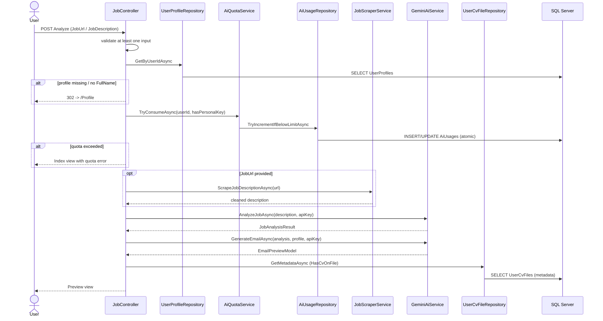
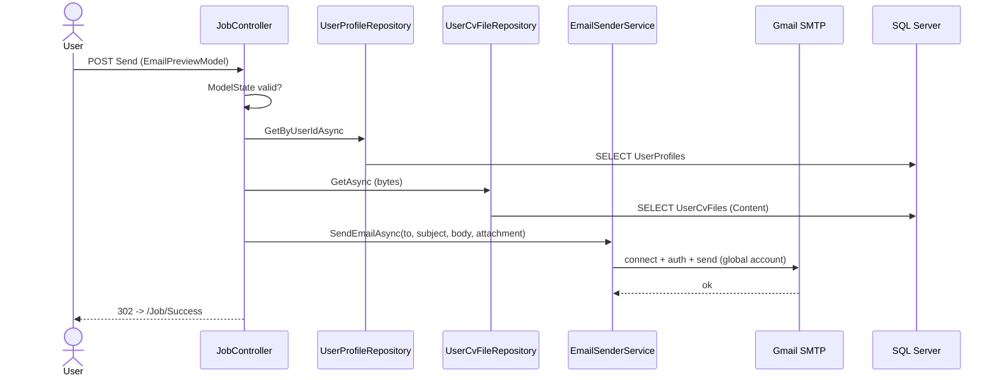
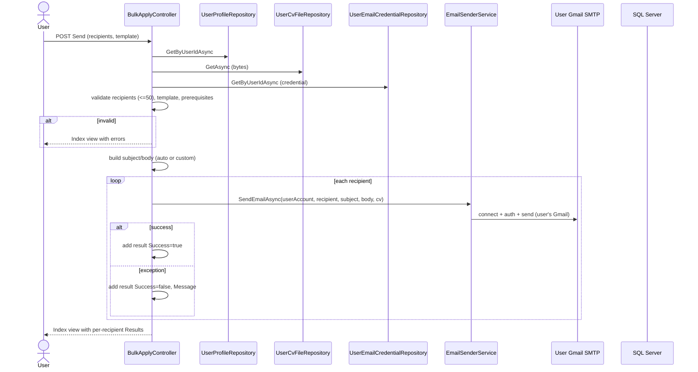
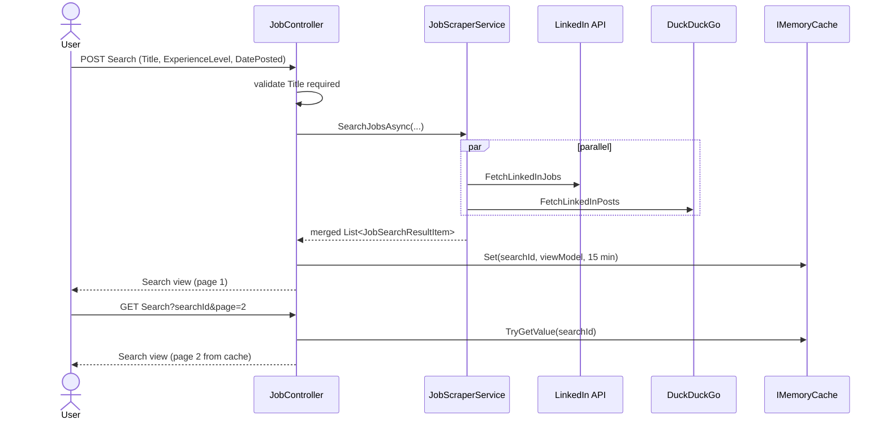
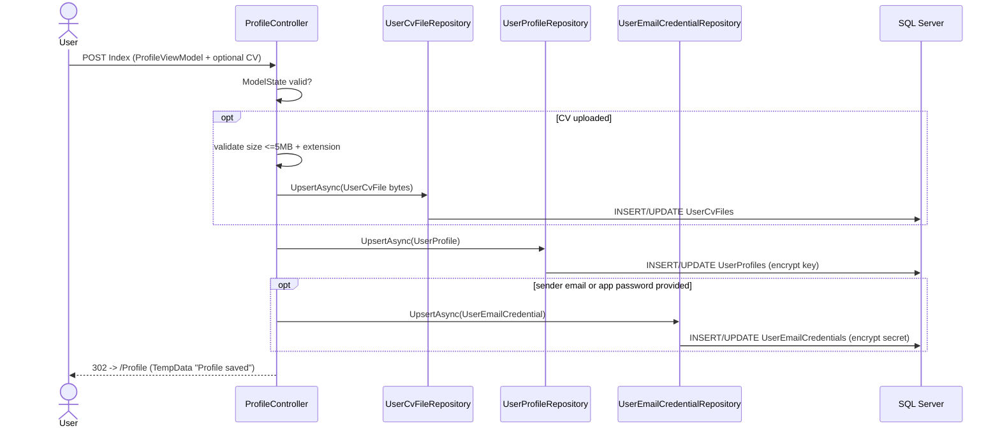
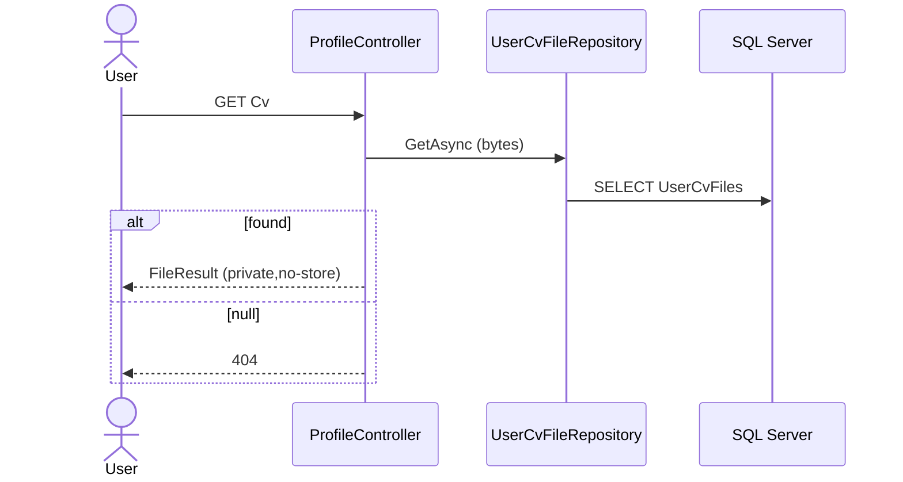
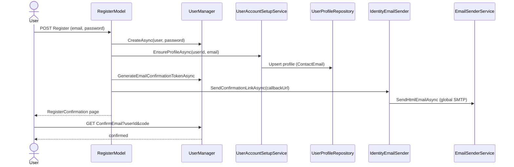
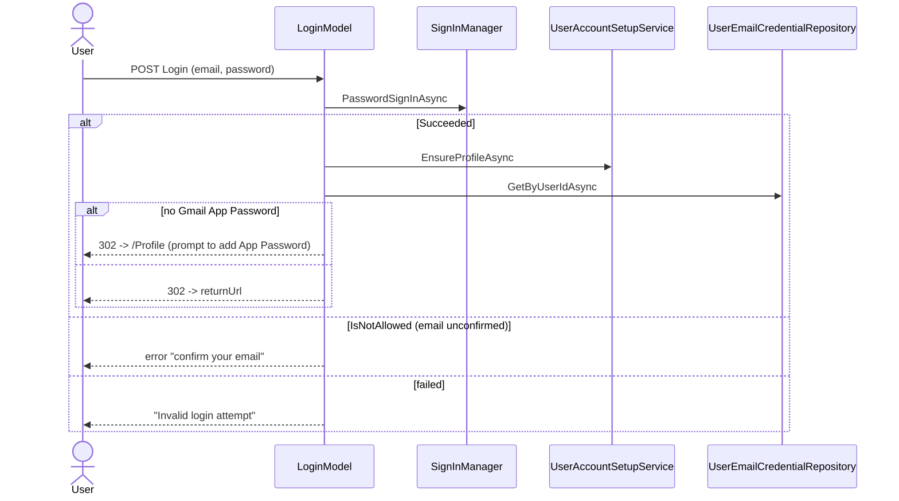

# 09 – Business Flows

> Each major workflow shown as: User Request → Controller → Service → Repository → Database → Response, with Mermaid sequence diagrams. Everything reflects the actual code paths.

## Table of Contents

- [1. AI Apply — Analyze Job](#1-ai-apply--analyze-job)
- [2. AI Apply — Send Email](#2-ai-apply--send-email)
- [3. Bulk Apply](#3-bulk-apply)
- [4. Job Search](#4-job-search)
- [5. Save Profile (+ CV + Credentials)](#5-save-profile--cv--credentials)
- [6. Download CV](#6-download-cv)
- [7. Register + Confirm Email](#7-register--confirm-email)
- [8. Login (with first-run prompt)](#8-login-with-first-run-prompt)

---

## 1. AI Apply — Analyze Job

**Path:** `POST /Job/Analyze`

**Notes:** quota is consumed **before** the AI calls; scrape/AI errors are caught and surfaced as model errors on the Index view.

---

## 2. AI Apply — Send Email

**Path:** `POST /Job/Send`

**Notes:** sends from the **global** SMTP account. On failure, error shown on the Preview view.

---

## 3. Bulk Apply

**Path:** `POST /BulkApply/Send`

**Notes:** best-effort per recipient; the user's own Gmail credential is used; a new SMTP connection is opened per recipient.

---

## 4. Job Search

**Path:** `POST /Job/Search` then `GET /Job/Search?searchId&page`

**Notes:** no database involvement; scraping failures return empty lists silently.

---

## 5. Save Profile (+ CV + Credentials)

**Path:** `POST /Profile/Index`

**Notes:** three separate `SaveChanges` calls (not a single transaction). PRG pattern on success.

---

## 6. Download CV

**Path:** `GET /Profile/Cv`

---

## 7. Register + Confirm Email

**Path:** `POST /Identity/Account/Register` → `GET /Identity/Account/ConfirmEmail`

---

## 8. Login (with first-run prompt)

**Path:** `POST /Identity/Account/Login`

---

_See also: [04-api-reference.md](04-api-reference.md) and the per-feature docs in [features/](features/)._
