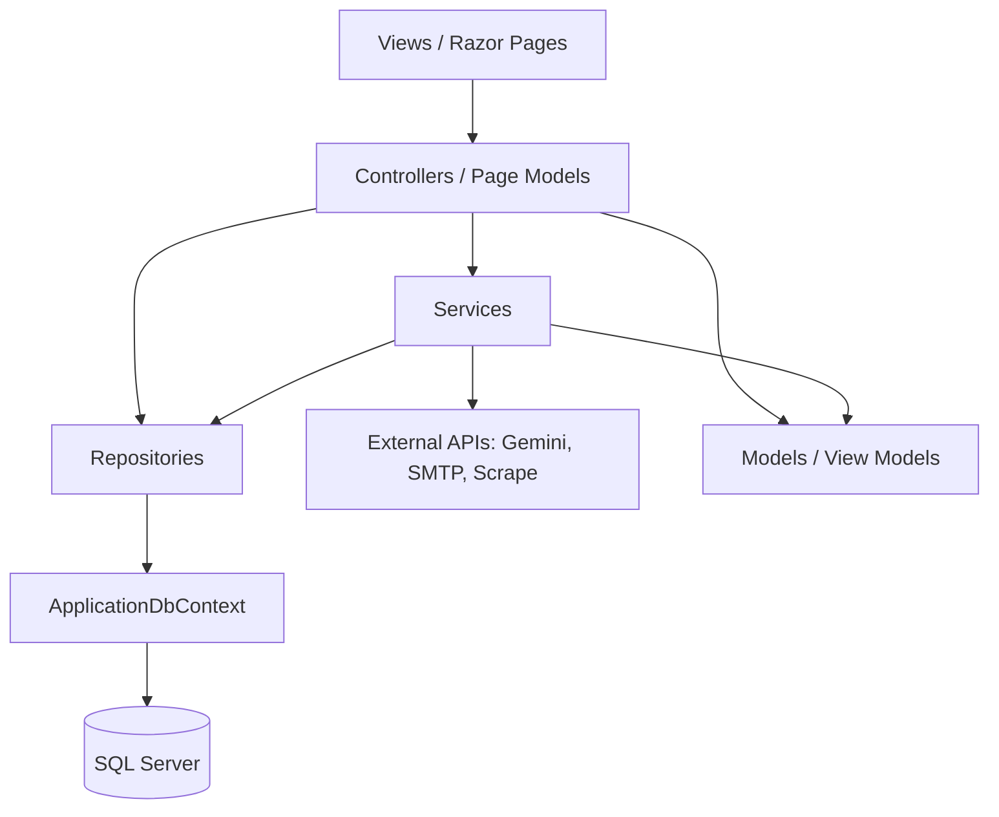

# 12 – Architecture & Design Decisions

> How the code is structured and why, based on what is actually implemented.

## Table of Contents

- [1. Architectural Style](#1-architectural-style)
- [2. Design Patterns in Use](#2-design-patterns-in-use)
- [3. SOLID Principles](#3-solid-principles)
- [4. Repository Pattern](#4-repository-pattern)
- [5. Dependency Injection](#5-dependency-injection)
- [6. CQRS](#6-cqrs)
- [7. Clean Architecture](#7-clean-architecture)
- [8. Layered Architecture](#8-layered-architecture)
- [9. Caching Strategy](#9-caching-strategy)
- [10. Logging Strategy](#10-logging-strategy)
- [11. Exception Handling Strategy](#11-exception-handling-strategy)
- [12. Validation Strategy](#12-validation-strategy)
- [13. Layering Rules (for contributors)](#13-layering-rules-for-contributors)

---

## 1. Architectural Style

A **single-project, layered (n-tier) monolith** built on ASP.NET Core 9 MVC + Razor Pages. Layers are separated by folder/namespace, not by assembly:

```
Presentation  → Controllers/, Views/, Areas/Identity/
Application   → Services/ (+ Services/Quota/)
Domain data   → Data/Entities/
Data access   → Data/Repositories/, Data/ApplicationDbContext.cs
Cross-cutting → Models/ (view models, options), Data/EncryptedStringConverter.cs
```

This is deliberately pragmatic for a small app: enough separation to test and reason about, without the overhead of multiple projects.

## 2. Design Patterns in Use

| Pattern | Where | Notes |
|---|---|---|
| **MVC** | Controllers + Views | Primary app UI |
| **Razor Pages** | Areas/Identity | Account management |
| **Repository** | `Data/Repositories/*` | One per aggregate, interface-based |
| **Dependency Injection** | `Program.cs` | Constructor injection everywhere |
| **Options pattern** | `AiSettings`, `EmailSettings` via `IOptions<T>` | Strongly-typed config |
| **Strategy (lightweight)** | `GeminiAiService` endpoint switch | Gemini vs OpenAI-compatible request shapes |
| **Adapter** | `IdentityEmailSender` | Adapts `IEmailSenderService` to Identity's `IEmailSender<T>` |
| **Value Converter** | `EncryptedStringConverter` | Transparent encrypt/decrypt at the EF layer |
| **DTO / View Model** | `Models/*` | Separates HTTP shape from entities |
| **PRG (Post/Redirect/Get)** | Profile save, Apply success | Avoids duplicate submits |
| **Records for immutability** | `EmailAttachment`, `EmailSenderAccount`, `QuotaCheckResult`, `CvFileMetadata` | Small value types |

## 3. SOLID Principles

- **S (Single Responsibility):** Services are focused (AI, scraping, email, quota, account setup). Controllers orchestrate; repositories persist.
- **O (Open/Closed):** LLM backend is switchable via config (`Ai:BaseUrl`) without changing callers.
- **L (Liskov):** Interfaces (`IAiService`, `IEmailSenderService`, etc.) are substitutable; `IdentityEmailSender` correctly fulfills `IEmailSender<ApplicationUser>`.
- **I (Interface Segregation):** Small, purpose-specific interfaces per repository/service.
- **D (Dependency Inversion):** Controllers/services depend on interfaces, resolved by DI.

**Deviations / where controllers do more than orchestrate:** `BulkApplyController` and `ProfileController` contain notable inline business logic (validation, template building, upsert sequencing) that could live in a service. See [code-quality.md](code-quality.md).

## 4. Repository Pattern

- Concrete repository per aggregate; **no generic repository** and **no Unit of Work** (the `DbContext` is the unit of work per request).
- Reads use `AsNoTracking()`; writes are upsert-style (load tracked → mutate → save).
- The AI usage repository additionally provides an **atomic conditional increment** with a retry loop (see [06-data-access.md](06-data-access.md#9-concurrency-handling)).

## 5. Dependency Injection

- All wiring in `Program.cs`.
- Lifetimes: `DbContext` + repositories + most services **Scoped**; typed `HttpClient` services (`IAiService`, `IJobScraperService`) effectively **Transient** via `AddHttpClient<>`; `IdentityEmailSender` **Transient**; `IMemoryCache` **Singleton**.
- No service locator / `IServiceProvider.GetService` calls in business code — pure constructor injection.

## 6. CQRS

**Not used.** No command/query separation, MediatR, or handlers. Controllers call services/repositories directly.

## 7. Clean Architecture

**Not implemented as such.** There is no separate Domain/Application/Infrastructure project boundary and no domain-centric dependency inversion at the project level. It is a layered monolith with interface-based seams. Entities are anemic (data-only) with logic in services/controllers.

## 8. Layered Architecture

The effective dependency direction:



Controllers may talk to both services and repositories. Services may use repositories. Repositories only touch the `DbContext`.

## 9. Caching Strategy

- **In-memory only** (`IMemoryCache`).
- Used for **job search results** (15-minute absolute expiration, key `{userId}:{guid}`) to support paging without re-scraping and to reduce outbound requests.
- No distributed cache; not suitable for multi-instance scale-out as-is (each instance has its own cache).

## 10. Logging Strategy

- Default `ILogger<T>` with console provider; levels from config.
- Targeted logs: email sends, startup email-config diagnostics, Identity login/forgot-password events, password-reset failures.
- No correlation IDs, structured sinks, or centralized log aggregation.

## 11. Exception Handling Strategy

Layered approach:

1. **Global:** production `UseExceptionHandler("/Home/Error")` + HSTS; dev developer page.
2. **Controller boundary:** `try/catch` around external calls in `Job.Analyze/Send/Search` and `BulkApply.Send`, converting exceptions to `ModelState` errors or per-recipient results (fail-soft UX).
3. **Service boundary:**
   - `GeminiAiService`: throws on HTTP/config errors; tolerates malformed AI JSON with fallbacks.
   - `JobScraperService`: swallows fetch errors for search (returns empty), propagates for single-URL scrape.
   - `EmailSenderService`: throws on missing global creds; propagates SMTP errors.

> Gap: `/Home/Error` has no matching action on `HomeController` (relies on the shared error view resolution). Also no centralized exception logging middleware. See [code-quality.md](code-quality.md).

## 12. Validation Strategy

Three complementary layers:

1. **Data annotations** on view models (`[Required]`, `[EmailAddress]`, `[StringLength]`, `[Compare]`) → checked via `ModelState.IsValid`.
2. **Controller-level imperative validation** for rules annotations cannot express: at-least-one-input (Analyze), CV size/extension (Profile), recipient count/format/dedupe + prerequisites (Bulk Apply), conditional required fields.
3. **Entity constraints** (`[MaxLength]`, `[Required]`) enforced at the DB level via EF mapping.

There is **no FluentValidation** and no shared validation service.

## 13. Layering Rules (for contributors)

To keep consistency (see also [.cursor/rules.md](../.cursor/rules.md)):

- **Keep controllers thin** — orchestrate, don't implement business rules; push reusable logic into `Services/`.
- **Business logic lives in services**, data access in repositories.
- **Never bypass repositories** to hit `DbContext` from controllers.
- **Reuse existing services** (`IAiService`, `IEmailSenderService`, `IAiQuotaService`, repositories) instead of duplicating.
- **Add secrets via encrypted columns** (`EncryptedStringConverter`) — never store plaintext credentials.
- **All timestamps in UTC.**
- **Thread `CancellationToken`** through new async methods.

---

_See also: [01-project-overview.md](01-project-overview.md), [06-data-access.md](06-data-access.md), [code-quality.md](code-quality.md)._
