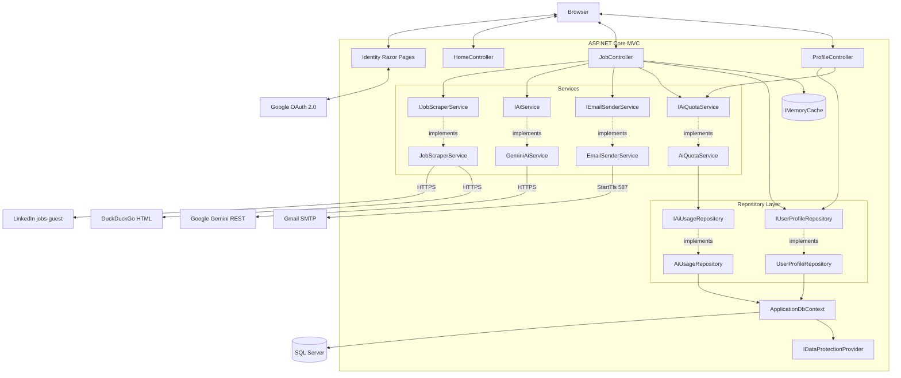
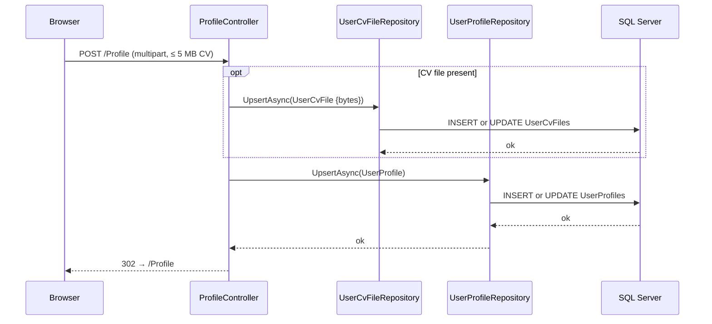
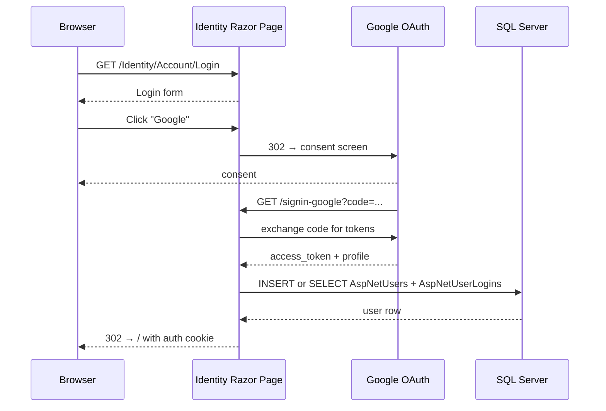

# Architecture Diagrams

## 1. Component Diagram



## 2. Request Flow Diagrams

### 2a. Analyze flow (POST /Job/Analyze)

```mermaid
sequenceDiagram
    participant Browser
    participant JobCtrl as JobController
    participant ProfRepo as UserProfileRepository
    participant Quota as AiQuotaService
    participant UsageRepo as AiUsageRepository
    participant Scraper
    participant Ai as GeminiAiService
    participant Sql as SQL Server
    participant Gemini

    Browser->>JobCtrl: POST /Job/Analyze
    JobCtrl->>ProfRepo: GetByUserIdAsync
    ProfRepo->>Sql: SELECT UserProfiles
    Sql-->>ProfRepo: row
    ProfRepo-->>JobCtrl: UserProfile
    JobCtrl->>Quota: TryConsumeAsync
    Quota->>UsageRepo: TryIncrementIfBelowLimitAsync
    UsageRepo->>Sql: SELECT/UPDATE/INSERT AiUsages
    Sql-->>UsageRepo: result
    UsageRepo-->>Quota: newCount or null
    Quota-->>JobCtrl: allowed?
    alt allowed
        opt URL provided
            JobCtrl->>Scraper: ScrapeJobDescriptionAsync
            Scraper-->>JobCtrl: cleaned text
        end
        JobCtrl->>Ai: AnalyzeJobAsync(desc, overrideKey?)
        Ai->>Gemini: POST :generateContent
        Gemini-->>Ai: JSON
        Ai-->>JobCtrl: JobAnalysisResult
        JobCtrl->>Ai: GenerateEmailAsync(analysis, profile, overrideKey?)
        Ai->>Gemini: POST :generateContent
        Gemini-->>Ai: JSON
        Ai-->>JobCtrl: EmailPreviewModel
        JobCtrl-->>Browser: View Preview
    else denied
        JobCtrl-->>Browser: Index view, quota error
    end
```



### 2b. Profile save flow (POST /Profile)



### 2c. Login flow with Google



## 3. Entity Relationship Diagram

The full schema lives in [DatabaseStructure.md](DatabaseStructure.md). Compact view:

```mermaid
erDiagram
    AspNetUsers ||--o| UserProfiles : "1:1"
    AspNetUsers ||--o| UserCvFiles : "1:1"
    AspNetUsers ||--o{ AiUsages : "1:many"
    AspNetUsers ||--o{ AspNetUserLogins : has
    AspNetUsers ||--o{ AspNetUserClaims : has

    AspNetUsers {
        nvarchar Id PK
        nvarchar Email
        nvarchar PasswordHash
    }
    UserProfiles {
        nvarchar UserId PK_FK
        nvarchar FullName
        nvarchar ContactEmail
        nvarchar PersonalGeminiApiKey "encrypted"
    }
    UserCvFiles {
        nvarchar UserId PK_FK
        nvarchar FileName
        nvarchar ContentType
        bigint SizeBytes
        varbinary Content "max"
    }
    AiUsages {
        int Id PK
        nvarchar UserId FK
        int Year
        int Month
        int CallCount
    }
    AspNetUserLogins {
        nvarchar LoginProvider PK
        nvarchar ProviderKey PK
        nvarchar UserId FK
    }
```

---

Last reviewed: 2026-06-01
