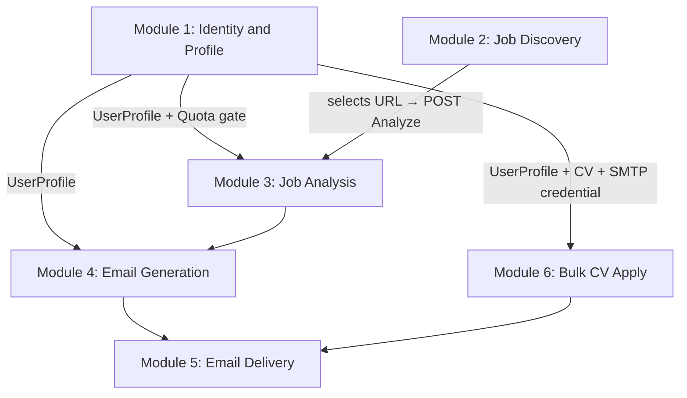

# Business Modules

Six logical modules. Module 1 was added in Phase 1, and Module 6 adds bulk CV apply with per-user SMTP credentials. Confidence: high.

## Module 1: Identity & Profile

**Purpose**: register, authenticate, and store per-user profile data + quota state.

| Aspect | Detail |
| --- | --- |
| Entry points | `/Identity/Account/Register`, `/Login`, `/Logout`, `/Profile` |
| Controllers | [Controllers/ProfileController.cs](../Controllers/ProfileController.cs) + Identity Razor Pages |
| Services | `UserManager<ApplicationUser>`, `SignInManager<ApplicationUser>`, `IUserProfileRepository`, `IUserCvFileRepository`, `IUserEmailCredentialRepository`, `IAiQuotaService` |
| Entities | [ApplicationUser](../Data/Entities/ApplicationUser.cs), [UserProfile](../Data/Entities/UserProfile.cs), [UserCvFile](../Data/Entities/UserCvFile.cs), [UserEmailCredential](../Data/Entities/UserEmailCredential.cs), [AiUsage](../Data/Entities/AiUsage.cs) |
| External | Google OAuth 2.0 (`/signin-google`), DataProtection |
| Storage | SQL Server only (`AspNetUsers`, `UserProfiles`, `UserCvFiles`, `UserEmailCredentials`, `AiUsages`). CVs are stored as `varbinary(max)` in `UserCvFiles.Content`; Gmail App Passwords are encrypted in `UserEmailCredentials.Secret`. |

**Behavior summary**:

- Identity tables are managed by ASP.NET Core Identity.
- `ProfileController.Index` (GET) hydrates a `ProfileViewModel` from the user's `UserProfile` row plus a metadata-only projection of the user's CV row (`IUserCvFileRepository.GetMetadataAsync`) and the current quota status. If no profile exists, `ContactEmail` defaults to the auth email.
- `ProfileController.Index` (POST) validates the form, optionally reads the uploaded CV into memory and upserts a `UserCvFile` row, then upserts the `UserProfile` row. The optional `PersonalGeminiApiKey` is stored encrypted at rest via `EncryptedStringConverter`.
- The Profile page also stores per-user Gmail SMTP sender settings. The App Password is never displayed back to the user and is encrypted at rest.
- `ProfileController.Cv` (GET) streams the stored CV back to its owner with the original `FileName` and `ContentType`. Other users' CVs are not addressable.
- The CV upload is restricted to `.pdf` / `.doc` / `.docx`, ≤ **5 MB**. The same 5 MB limit is enforced at Kestrel (`MaxRequestBodySize` 6 MB), at the multipart parser (`MultipartBodyLengthLimit` 6 MB), and inside the controller (`IFormFile.Length` ≤ 5 MB) for defense in depth.
- `IAiQuotaService.GetStatusAsync` returns `(used, limit, bypassedByPersonalKey)` for the UI's progress bar.

## Module 2: Job Discovery

**Purpose**: find candidate job postings on LinkedIn and posts shared on LinkedIn.

| Aspect | Detail |
| --- | --- |
| Entry points | `GET/POST /Job/Search` |
| Controller | [Controllers/JobController.cs](../Controllers/JobController.cs) |
| Service | `IJobScraperService.SearchJobsAsync` ([Services/JobScraperService.cs](../Services/JobScraperService.cs)) |
| External | LinkedIn `jobs-guest` API; DuckDuckGo HTML search |
| State | Per-user search cache in `IMemoryCache`, keyed `{userId}:{guid}`, 15-min TTL |

Module unchanged in Phase 1, except the search cache is now per-user-scoped.

## Module 3: Job Analysis

**Purpose**: turn a job description into a structured `JobAnalysisResult` via Gemini.

| Aspect | Detail |
| --- | --- |
| Entry point | `POST /Job/Analyze` (first half) |
| Service | `IAiService.AnalyzeJobAsync(desc, overrideApiKey?)` ([Services/GeminiService.cs](../Services/GeminiService.cs)) |
| External | Google Gemini REST |
| Quota | `IAiQuotaService.TryConsumeAsync` runs **before** the call; users with `PersonalGeminiApiKey` bypass the counter |

**Phase 1 changes**:

- The AI service now accepts an optional `overrideApiKey` per call. The controller passes the user's personal key when present.
- The `IOptions<UserProfile>` constructor parameter on the AI service was removed; profile data flows through the explicit `GenerateEmailAsync(analysis, profile, ...)` parameter.

## Module 4: Email Generation

**Purpose**: produce a tailored application email body and subject.

| Aspect | Detail |
| --- | --- |
| Entry point | `POST /Job/Analyze` (second half) |
| Service | `IAiService.GenerateEmailAsync(analysis, profile, overrideApiKey?)` |
| Models | [JobAnalysisResult](../Models/JobAnalysisResult.cs), [UserProfile](../Data/Entities/UserProfile.cs) → [EmailPreviewModel](../Models/EmailPreviewModel.cs) |
| View | [Views/Job/Preview.cshtml](../Views/Job/Preview.cshtml) |

The `profile` parameter is now the EF Core entity ([Data/Entities/UserProfile.cs](../Data/Entities/UserProfile.cs)) loaded from SQL Server, not the deleted singleton config POCO. Skill matching logic is unchanged: case-insensitive substring against `SkillsSummary`.

## Module 5: Email Delivery

**Purpose**: send the email via SMTP with the user's CV attached.

| Aspect | Detail |
| --- | --- |
| Entry point | `POST /Job/Send` |
| Service | `IEmailSenderService.SendEmailAsync` |
| External | Gmail SMTP (or any SMTP via `EmailSettings`) |

**Unchanged in Phase 1.** The `From` is still the shared `EmailSettings.SenderEmail`. Phase 2 will replace this with Gmail OAuth + BYO SMTP per user.

## Module 6: Bulk CV Apply

**Purpose**: send the logged-in user's saved CV to multiple manually-entered recipient emails.

| Aspect | Detail |
| --- | --- |
| Entry point | `GET /BulkApply`, `POST /BulkApply/Send` |
| Controller | [Controllers/BulkApplyController.cs](../Controllers/BulkApplyController.cs) |
| Service | `IEmailSenderService.SendEmailAsync(EmailSenderAccount, ...)` |
| Data | `UserProfile`, `UserCvFile`, `UserEmailCredential` |
| External | Gmail SMTP using the user's Gmail App Password |

**Behavior summary**:

- The user enters recipient emails as dynamic rows.
- The user's stored CV is attached to every recipient by default.
- A custom subject/body can be reused for all recipients, or the controller builds a deterministic profile-based template without calling Gemini.
- Results are displayed per recipient so one SMTP failure does not hide earlier successful sends.

## Module Interaction

---

Last reviewed: 2026-06-01
