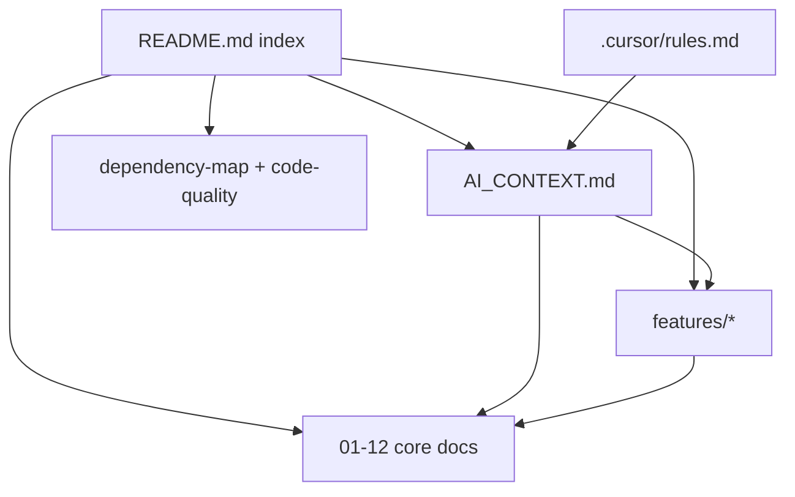

# SmartApply Hub — Documentation Index

> Knowledge base for **SmartApply Hub** (project `JobApplicationBot`) — an ASP.NET Core 9 MVC app for AI-powered job applications. Built for onboarding developers and for AI assistants (Cursor, ChatGPT).

## Start Here

- 🧠 **[AI_CONTEXT.md](AI_CONTEXT.md)** — read this first (compressed authoritative summary).
- 📏 **[../.cursor/rules.md](../.cursor/rules.md)** — rules for AI-assisted development.

## Core Documentation

| # | Document | Contents |
|---|---|---|
| 01 | [Project Overview](01-project-overview.md) | Purpose, architecture, folders, `Program.cs`, DI, middleware, tech, integrations, config, logging, error handling, diagram |
| 02 | [Business Domain](02-business-domain.md) | Modules, roles, permissions, workflows, entities, business rules, end-to-end process |
| 03 | [Database](03-database.md) | Entities, tables, keys, relationships, EF config, audit, soft delete, indexes, encryption, ER diagram |
| 04 | [API / Endpoint Reference](04-api-reference.md) | Every controller action + Identity pages, auth, models, status codes |
| 05 | [Services](05-services.md) | Each service: responsibility, deps, methods, logic, exceptions |
| 06 | [Data Access](06-data-access.md) | Repository pattern, LINQ, transactions, concurrency, performance |
| 07 | [Security](07-security.md) | Auth, authorization, Identity, roles/claims, token flows, encryption, concerns |
| 08 | [Configuration](08-configuration.md) | appsettings, options, connection string, SMTP, secrets, what's not present |
| 09 | [Business Flows](09-business-flows.md) | Request→Controller→Service→Repo→DB sequence diagrams |
| 10 | [DTOs & View Models](10-dtos.md) | Every model: properties, validation, related APIs/entities |
| 11 | [Background Jobs](11-background-jobs.md) | (None) — async/parallelism/caching explained |
| 12 | [Architecture](12-architecture.md) | Patterns, SOLID, layering, caching/logging/exception/validation strategies |

## Feature Documentation

| Feature | Document |
|---|---|
| Authentication & Account | [features/Authentication.md](features/Authentication.md) |
| Profile | [features/Profile.md](features/Profile.md) |
| AI Apply (single) | [features/AiApply.md](features/AiApply.md) |
| Bulk Apply | [features/BulkApply.md](features/BulkApply.md) |
| Job Search | [features/JobSearch.md](features/JobSearch.md) |
| AI Quota (freemium) | [features/AiQuota.md](features/AiQuota.md) |

## Cross-Cutting Reports

| Document | Contents |
|---|---|
| [Dependency Map](dependency-map.md) | Project refs, NuGet packages, external services, component/layer diagrams |
| [Code Quality Report](code-quality.md) | Strengths, smells, tech debt, security, performance, refactors (no code changed) |

## How This Documentation Is Organized

## Conventions Used in These Docs

- Every document has a Table of Contents.
- Diagrams use **Mermaid** (rendered by GitHub, VS Code, and most Markdown viewers).
- Anything not present in the code is stated explicitly (e.g. "no background jobs", "no roles").
- Findings in [code-quality.md](code-quality.md) are **reports only** — no source code was modified to produce this documentation.

## Maintenance

When code changes, update the matching document(s) and, if architecture/entities/services change, [AI_CONTEXT.md](AI_CONTEXT.md). See the rules in [../.cursor/rules.md](../.cursor/rules.md).

> **Note:** Older ad-hoc docs may exist in this folder from a previous effort (e.g. `ProjectOverview.md`, `DatabaseStructure.md`). The **canonical** set is the numbered `01`–`12` files, `features/`, `AI_CONTEXT.md`, `dependency-map.md`, and `code-quality.md` listed above.
