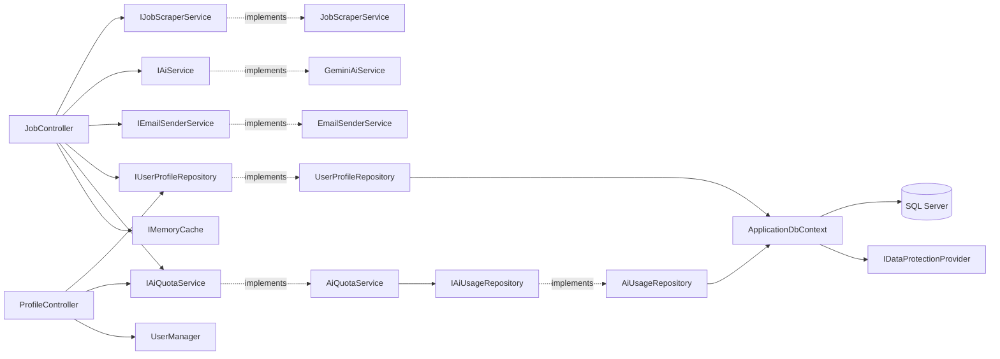

# Repository Map

## Solution Composition

[JobApplicationBot.sln](../JobApplicationBot.sln) declares a single project:

| Project | Path | SDK | Target |
| --- | --- | --- | --- |
| JobApplicationBot | [JobApplicationBot.csproj](../JobApplicationBot.csproj) | `Microsoft.NET.Sdk.Web` | `net9.0` |

## Folder Structure

```
JobApplicationBot/
├── Areas/
│   └── Identity/
│       └── Pages/
│           └── _ViewStart.cshtml          Forces Identity UI to use the app _Layout
├── Controllers/
│   ├── HomeController.cs                  Redirects to Job/Index or Login
│   ├── JobController.cs                   [Authorize] Index, Analyze, Send, Success, Search
│   └── ProfileController.cs               [Authorize] profile editor + CV upload
├── Data/
│   ├── ApplicationDbContext.cs            EF Core context (extends IdentityDbContext)
│   ├── EncryptedStringConverter.cs        DataProtection-backed value converter
│   ├── Entities/
│   │   ├── ApplicationUser.cs             Extends IdentityUser
│   │   ├── UserProfile.cs                 1:1 per user
│   │   └── AiUsage.cs                     Per-user monthly quota counter
│   └── Repositories/
│       ├── IUserProfileRepository.cs / UserProfileRepository.cs
│       └── IAiUsageRepository.cs / AiUsageRepository.cs
├── Migrations/                            EF Core migrations (initial: InitialIdentityAndProfile)
├── Models/                                DTOs / view-models / settings POCOs
│   ├── AppSettings.cs                     AiSettings, EmailSettings (UserProfile POCO removed)
│   ├── EmailPreviewModel.cs
│   ├── ErrorViewModel.cs
│   ├── JobAnalysisResult.cs
│   ├── JobInput.cs
│   ├── JobSearchFilter.cs
│   ├── JobSearchResultItem.cs
│   ├── JobSearchViewModel.cs
│   └── ProfileViewModel.cs                Profile editor view-model
├── Services/
│   ├── EmailSenderService.cs              IEmailSenderService → MailKit SMTP
│   ├── GeminiService.cs                   IAiService (with overrideApiKey support)
│   ├── JobScraperService.cs               IJobScraperService → LinkedIn + DuckDuckGo
│   └── Quota/
│       ├── IAiQuotaService.cs / AiQuotaService.cs
├── Views/
│   ├── _ViewImports.cshtml                Includes JobApplicationBot.Data.Entities + Identity
│   ├── _ViewStart.cshtml
│   ├── Home/
│   ├── Job/
│   │   ├── Index.cshtml
│   │   ├── Preview.cshtml
│   │   ├── Search.cshtml
│   │   └── Success.cshtml
│   ├── Profile/
│   │   └── Index.cshtml                   Profile editor + CV upload + quota indicator
│   └── Shared/
│       ├── _Layout.cshtml                 Now renders _LoginPartial
│       ├── _LoginPartial.cshtml           Login/Logout/Register/Profile nav
│       ├── _ValidationScriptsPartial.cshtml
│       └── Error.cshtml
├── wwwroot/                               Bootstrap, icons, favicon
├── appsettings.json                       Connection string, AI, Email, Google OAuth
├── appsettings.Development.json
├── Program.cs                             Composition root
├── JobApplicationBot.csproj
└── JobApplicationBot.sln
```

## File-Level Component Map

| Component | File | Public surface |
| --- | --- | --- |
| App entry / DI composition | [Program.cs](../Program.cs) | n/a |
| Job feature controller | [Controllers/JobController.cs](../Controllers/JobController.cs) | `Index`, `Analyze`, `Send`, `Success`, `Search` (GET/POST) |
| Bulk apply controller | [Controllers/BulkApplyController.cs](../Controllers/BulkApplyController.cs) | `Index` (GET), `Send` (POST) |
| Profile controller | [Controllers/ProfileController.cs](../Controllers/ProfileController.cs) | `Index` (GET/POST), `Cv` (GET — streams stored CV) |
| Home redirect | [Controllers/HomeController.cs](../Controllers/HomeController.cs) | `Index` |
| EF Core context | [Data/ApplicationDbContext.cs](../Data/ApplicationDbContext.cs) | `UserProfiles`, `UserCvFiles`, `UserEmailCredentials`, `AiUsages` + Identity DbSets |
| CV file repository | [Data/Repositories/UserCvFileRepository.cs](../Data/Repositories/UserCvFileRepository.cs) | `IUserCvFileRepository` (`Get`, `GetMetadata`, `Upsert`, `Delete`) |
| Email credential repository | [Data/Repositories/UserEmailCredentialRepository.cs](../Data/Repositories/UserEmailCredentialRepository.cs) | `IUserEmailCredentialRepository` (`GetByUserId`, `Upsert`, `Delete`) |
| AI service | [Services/GeminiService.cs](../Services/GeminiService.cs) | `IAiService.AnalyzeJobAsync(desc, overrideKey?)`, `GenerateEmailAsync(...)` |
| Scraper | [Services/JobScraperService.cs](../Services/JobScraperService.cs) | `ScrapeJobDescriptionAsync`, `SearchJobsAsync` |
| Email sender | [Services/EmailSenderService.cs](../Services/EmailSenderService.cs) | `SendEmailAsync`, per-user `EmailSenderAccount`, `SendHtmlEmailAsync` |
| Quota service | [Services/Quota/AiQuotaService.cs](../Services/Quota/AiQuotaService.cs) | `GetStatusAsync`, `TryConsumeAsync` |
| Profile repository | [Data/Repositories/UserProfileRepository.cs](../Data/Repositories/UserProfileRepository.cs) | `GetByUserIdAsync`, `UpsertAsync` |
| Usage repository | [Data/Repositories/AiUsageRepository.cs](../Data/Repositories/AiUsageRepository.cs) | `GetCurrentMonthCountAsync`, `TryIncrementIfBelowLimitAsync` |
| Encrypted string converter | [Data/EncryptedStringConverter.cs](../Data/EncryptedStringConverter.cs) | `ValueConverter<string?, string?>` using DataProtection |

## NuGet Dependencies

| Package | Version | Used by |
| --- | --- | --- |
| `Microsoft.EntityFrameworkCore.SqlServer` | 9.0.0 | EF Core context |
| `Microsoft.EntityFrameworkCore.Design` | 9.0.0 | `dotnet ef` tooling (PrivateAssets=all) |
| `Microsoft.AspNetCore.Identity.EntityFrameworkCore` | 9.0.0 | `IdentityDbContext`, store implementation |
| `Microsoft.AspNetCore.Identity.UI` | 9.0.0 | Default Razor Pages for register/login |
| `Microsoft.AspNetCore.Authentication.Google` | 9.0.0 | Google OAuth 2.0 sign-in |
| `HtmlAgilityPack` | 1.12.4 | Scraping |
| `MailKit` | 4.15.0 | SMTP send |
| `MimeKit` | 4.15.0 | MIME message build |

The `Mscc.GenerativeAI` package was removed during Phase 1 — Gemini is called via raw `HttpClient` in [Services/GeminiService.cs](../Services/GeminiService.cs).

## Dependency Graph



---

Last reviewed: 2026-06-01
