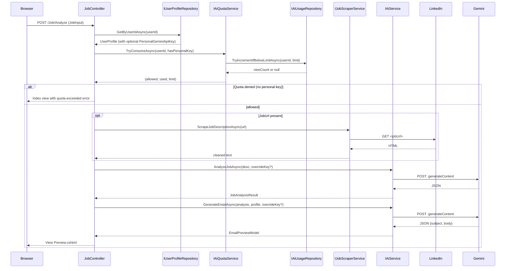
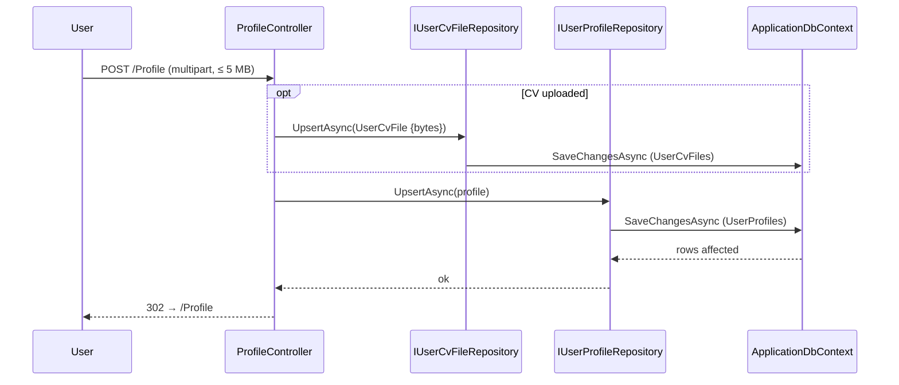
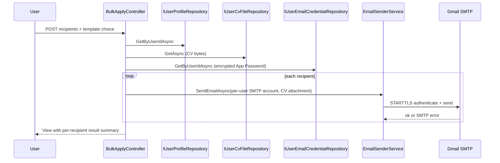

# Service Flow

## Layer Topology

Phase 1 introduced the Repository tier and the Database. The full topology is now:

```
Controller   →   Service / Quota / Repository   →   ApplicationDbContext   →   SQL Server
                                              ↘   External system (Gemini / LinkedIn / DuckDuckGo / SMTP)
```

External-system calls bypass the Repository tier; nothing about an external response is persisted.

## Request Flows

### Flow A — Analyze a job (POST /Job/Analyze)



### Flow B — Save profile (POST /Profile)



### Flow C — Bulk apply (POST /BulkApply/Send)



## Dependency Injection Structure

Source: [Program.cs](../Program.cs).

| Registration | Lifetime | Used by |
| --- | --- | --- |
| `AddControllersWithViews()` | n/a | MVC |
| `AddRazorPages()` | n/a | Identity UI |
| `AddDbContext<ApplicationDbContext>(...)` | Scoped | Repositories |
| `AddDataProtection()` | Singleton | `EncryptedStringConverter` |
| `AddDefaultIdentity<ApplicationUser>()` + `AddEntityFrameworkStores<ApplicationDbContext>()` | (multiple lifetimes) | Identity UI, controllers |
| `AddAuthentication().AddGoogle(...)` (when configured) | n/a | External login |
| `Configure<AiSettings>(...)` / `Configure<EmailSettings>(...)` | Singleton (`IOptions`) | `GeminiAiService`, `EmailSenderService`, `AiQuotaService` |
| `AddHttpClient<IJobScraperService, JobScraperService>()` | Transient (typed client) | `JobController` |
| `AddHttpClient<IAiService, GeminiAiService>()` | Transient (typed client) | `JobController` |
| `AddScoped<IEmailSenderService, EmailSenderService>()` | Scoped | `JobController`, `BulkApplyController`, Identity email adapter |
| `AddScoped<IUserProfileRepository, UserProfileRepository>()` | Scoped | `JobController`, `ProfileController` |
| `AddScoped<IUserCvFileRepository, UserCvFileRepository>()` | Scoped | `JobController`, `ProfileController` |
| `AddScoped<IUserEmailCredentialRepository, UserEmailCredentialRepository>()` | Scoped | `ProfileController`, `BulkApplyController` |
| `AddScoped<IAiUsageRepository, AiUsageRepository>()` | Scoped | `AiQuotaService` |
| `AddScoped<IAiQuotaService, AiQuotaService>()` | Scoped | `JobController`, `ProfileController` |
| `AddMemoryCache()` | Singleton | `JobController` |
| `AddSession()` | Singleton store | TempData |
| `ConfigureApplicationCookie(...)` | n/a | Identity cookie paths |

## Pipeline (HTTP middleware)

From [Program.cs](../Program.cs):

1. (Production) `UseExceptionHandler("/Home/Error")` and `UseHsts()`
2. `UseHttpsRedirection()`
3. `UseRouting()`
4. `UseSession()`
5. **`UseAuthentication()`** (new)
6. `UseAuthorization()`
7. `MapStaticAssets()`
8. `MapControllerRoute(default = "Home/Index/{id?}")`
9. `MapRazorPages()` (Identity UI)

Authentication MUST precede Authorization, which is now required (not just registered) because of `[Authorize]` on `JobController` and `ProfileController`.

## Constructor Dependency Map

| Type | Depends on |
| --- | --- |
| `JobController` | `IJobScraperService`, `IAiService`, `IEmailSenderService`, `IUserProfileRepository`, `IUserCvFileRepository`, `IAiQuotaService`, `IMemoryCache` |
| `BulkApplyController` | `IUserProfileRepository`, `IUserCvFileRepository`, `IUserEmailCredentialRepository`, `IEmailSenderService` |
| `ProfileController` | `IUserProfileRepository`, `IUserCvFileRepository`, `IUserEmailCredentialRepository`, `IAiQuotaService`, `UserManager<ApplicationUser>` |
| `GeminiAiService` | `HttpClient`, `IOptions<AiSettings>` |
| `JobScraperService` | `HttpClient` |
| `EmailSenderService` | `IOptions<EmailSettings>` |
| `AiQuotaService` | `IAiUsageRepository`, `IOptions<AiSettings>` |
| `UserProfileRepository` | `ApplicationDbContext` |
| `UserCvFileRepository` | `ApplicationDbContext` |
| `UserEmailCredentialRepository` | `ApplicationDbContext` |
| `AiUsageRepository` | `ApplicationDbContext` |
| `ApplicationDbContext` | `DbContextOptions`, optional `IDataProtectionProvider` |

---

Last reviewed: 2026-06-01
