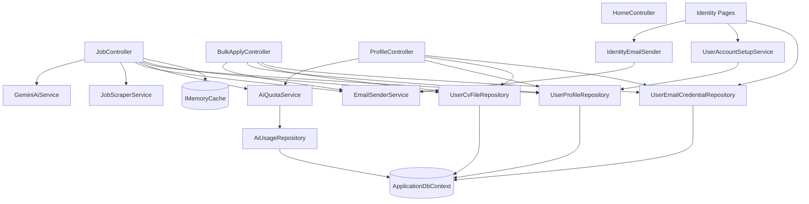
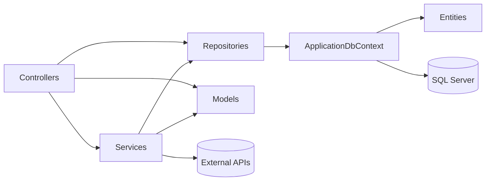

# Dependency Map

> Project references, internal component dependencies, external services, and third-party libraries.

## Table of Contents

- [1. Project References](#1-project-references)
- [2. Third-Party Libraries (NuGet)](#2-third-party-libraries-nuget)
- [3. External Services](#3-external-services)
- [4. Controller → Dependency Map](#4-controller--dependency-map)
- [5. Service Dependencies](#5-service-dependencies)
- [6. Repository Dependencies](#6-repository-dependencies)
- [7. Component Dependency Diagram](#7-component-dependency-diagram)
- [8. Namespace / Layer Dependency Diagram](#8-namespace--layer-dependency-diagram)

---

## 1. Project References

Single project (`JobApplicationBot.csproj`, `net9.0`). **No project-to-project references** (monolith). No solution-level `.sln` project graph beyond this one project.

## 2. Third-Party Libraries (NuGet)

| Package | Version | Used For | Consumed By |
|---|---|---|---|
| `HtmlAgilityPack` | 1.12.4 | HTML parsing/scraping | `JobScraperService` |
| `MailKit` | 4.15.0 | SMTP client | `EmailSenderService` |
| `MimeKit` | 4.15.0 | MIME message building | `EmailSenderService` |
| `Microsoft.AspNetCore.Authentication.Google` | 9.0.0 | Google OAuth | `Program.cs` (optional) |
| `Microsoft.AspNetCore.Identity.EntityFrameworkCore` | 9.0.0 | Identity stores | `ApplicationDbContext`, `Program.cs` |
| `Microsoft.AspNetCore.Identity.UI` | 9.0.0 | Identity default UI assets | Identity area |
| `Microsoft.EntityFrameworkCore.SqlServer` | 9.0.0 | EF Core SQL Server provider | `ApplicationDbContext`, repositories |
| `Microsoft.EntityFrameworkCore.Design` | 9.0.0 | Migrations/design-time (PrivateAssets) | tooling |

Implicit framework references (via `Microsoft.NET.Sdk.Web`): ASP.NET Core MVC, Razor Pages, DataProtection, MemoryCache, Session, Options, Logging, HttpClientFactory.

**Front-end (CDN, not NuGet):** Bootstrap 5.3.3, Bootstrap Icons 1.11.3 (referenced in `_Layout.cshtml`).

## 3. External Services

| Service | Endpoint | Consumer | Failure mode |
|---|---|---|---|
| Google Gemini | `generativelanguage.googleapis.com/v1beta` | `GeminiAiService` | throws → caught in controller |
| OpenAI-compatible LLM (optional) | `Ai:BaseUrl` (non-google host) | `GeminiAiService` | throws → caught |
| LinkedIn guest jobs API | `linkedin.com/jobs-guest/...` | `JobScraperService` | swallowed → empty |
| DuckDuckGo HTML | `html.duckduckgo.com/html/` | `JobScraperService` | swallowed → empty |
| Gmail SMTP | `smtp.gmail.com:587` | `EmailSenderService` | throws → caught/recorded |
| Google OAuth (optional) | Google identity | Identity | only if configured |
| SQL Server | `ConnectionStrings:DefaultConnection` | EF Core | startup throws if missing |

## 4. Controller → Dependency Map

| Controller | Services | Repositories | Other |
|---|---|---|---|
| `HomeController` | — | — | — |
| `JobController` | `IJobScraperService`, `IAiService`, `IEmailSenderService`, `IAiQuotaService` | `IUserProfileRepository`, `IUserCvFileRepository` | `IMemoryCache` |
| `BulkApplyController` | `IEmailSenderService` | `IUserProfileRepository`, `IUserCvFileRepository`, `IUserEmailCredentialRepository` | — |
| `ProfileController` | `IAiQuotaService` | `IUserProfileRepository`, `IUserCvFileRepository`, `IUserEmailCredentialRepository` | `UserManager<ApplicationUser>` |
| `RegisterModel` | `IEmailSender<ApplicationUser>`, `IUserAccountSetupService` | — | `UserManager`, `SignInManager`, `IUserStore` |
| `LoginModel` | `IUserAccountSetupService` | `IUserEmailCredentialRepository` | `UserManager`, `SignInManager` |
| `ForgotPasswordModel` | `IEmailSender<ApplicationUser>` | — | `UserManager` |
| `ConfirmEmailModel` | — | — | `UserManager` |

## 5. Service Dependencies

| Service | Depends on |
|---|---|
| `GeminiAiService` | `HttpClient`, `IOptions<AiSettings>` |
| `JobScraperService` | `HttpClient` |
| `EmailSenderService` | `IOptions<EmailSettings>`, `ILogger` |
| `IdentityEmailSender` | `IEmailSenderService` |
| `UserAccountSetupService` | `IUserProfileRepository` |
| `AiQuotaService` | `IAiUsageRepository`, `IOptions<AiSettings>` |

## 6. Repository Dependencies

All four repositories depend solely on `ApplicationDbContext`:

| Repository | Depends on |
|---|---|
| `UserProfileRepository` | `ApplicationDbContext` |
| `UserCvFileRepository` | `ApplicationDbContext` |
| `UserEmailCredentialRepository` | `ApplicationDbContext` |
| `AiUsageRepository` | `ApplicationDbContext` |

`ApplicationDbContext` optionally depends on `IDataProtectionProvider` (for encrypted columns).

## 7. Component Dependency Diagram

## 8. Namespace / Layer Dependency Diagram

**Allowed direction:** Presentation → Services/Repositories → Data → DB. No layer references upward. Models are shared cross-cutting types.

---

_See also: [05-services.md](05-services.md), [06-data-access.md](06-data-access.md), [12-architecture.md](12-architecture.md)._
