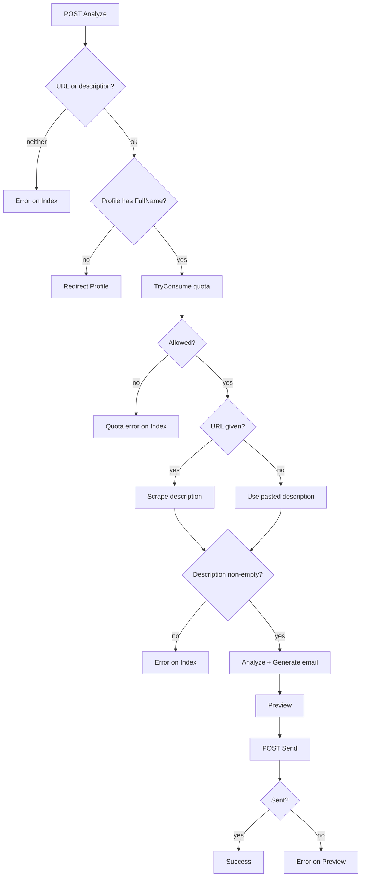

# Feature: AI Apply (Single Job)

> Analyze one job posting with AI, generate a tailored application email, preview, edit, and send with the CV attached.

## Table of Contents

- [Business Purpose](#business-purpose)
- [User Roles](#user-roles)
- [Controllers](#controllers)
- [Services](#services)
- [Database Tables](#database-tables)
- [DTOs](#dtos)
- [APIs / Endpoints](#apis--endpoints)
- [Business Rules](#business-rules)
- [Sequence Diagram](#sequence-diagram)
- [Flow Chart](#flow-chart)
- [Validation](#validation)
- [Permissions](#permissions)
- [Related Modules](#related-modules)
- [Known Limitations](#known-limitations)

## Business Purpose

The core value proposition: paste a job URL or description and get a ready-to-send, personalized application email in seconds, using the candidate's stored profile and CV.

## User Roles

Authenticated User only.

## Controllers

- `JobController` (`[Authorize]`): `GET Index`, `POST Analyze`, `POST Send`, `GET Success`.
  - Deps: `IJobScraperService`, `IAiService`, `IEmailSenderService`, `IUserProfileRepository`, `IUserCvFileRepository`, `IAiQuotaService`, `IMemoryCache`.

## Services

- `JobScraperService.ScrapeJobDescriptionAsync` — extract description from a URL.
- `GeminiAiService.AnalyzeJobAsync` + `GenerateEmailAsync` — LLM analysis + email draft.
- `AiQuotaService.TryConsumeAsync` — enforce freemium quota.
- `EmailSenderService.SendEmailAsync` — send via **global** SMTP with CV attachment.

## Database Tables

- `UserProfiles` (read), `UserCvFiles` (metadata + bytes), `AiUsages` (read/write via quota).

## DTOs

- Request: `JobInput`. Intermediate: `JobAnalysisResult`. Preview/send: `EmailPreviewModel`. Attachment record: `EmailAttachment`. See [10-dtos.md](../10-dtos.md).

## APIs / Endpoints

- `GET /Job` — input form.
- `POST /Job/Analyze` — analyze + generate → Preview.
- `POST /Job/Send` — send email → Success.
- `GET /Job/Success` — confirmation.

See [04-api-reference.md](../04-api-reference.md#3-jobcontroller).

## Business Rules

- Must provide at least one of `JobUrl` / `JobDescription`.
- Profile must exist with non-empty `FullName`, else redirect to Profile.
- Quota consumed **before** AI calls unless the user has a personal Gemini key (which bypasses and is used as the API key).
- Extracted description must be non-empty to proceed.
- `ToEmail` defaults to the AI-extracted contact email (may be blank → user fills it).
- Email is sent from the **global** SMTP sender (not the user's Gmail).
- CV attached only if one is stored and non-empty.

## Sequence Diagram

Analyze: [09-business-flows.md#1](../09-business-flows.md#1-ai-apply--analyze-job). Send: [#2](../09-business-flows.md#2-ai-apply--send-email).

## Flow Chart

## Validation

`JobInput` at-least-one rule (controller); `EmailPreviewModel` data annotations (`ToEmail` email, subject/body required); try/catch around scrape+AI+send.

## Permissions

`[Authorize]`; per-user data scoping.

## Related Modules

[Profile](Profile.md), [AI Quota](AiQuota.md), [Job Search](JobSearch.md) (discovery), [Bulk Apply](BulkApply.md) (multi-recipient variant).

## Known Limitations

- **Quota is consumed even if the AI call later fails.**
- **SSRF risk:** arbitrary user URL fetched server-side without allowlist ([07-security.md](../07-security.md#13-known-security-concerns)).
- AI JSON parsing failures fall back to raw text (subject/body may be unpolished).
- Scraping generic pages is heuristic; JS-heavy postings may yield poor text.
- Single-send always uses the global SMTP account, so the recipient sees the app's mailbox, not the candidate's.
