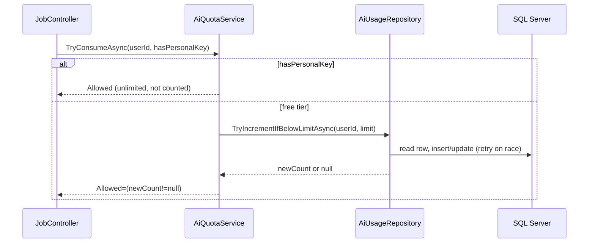
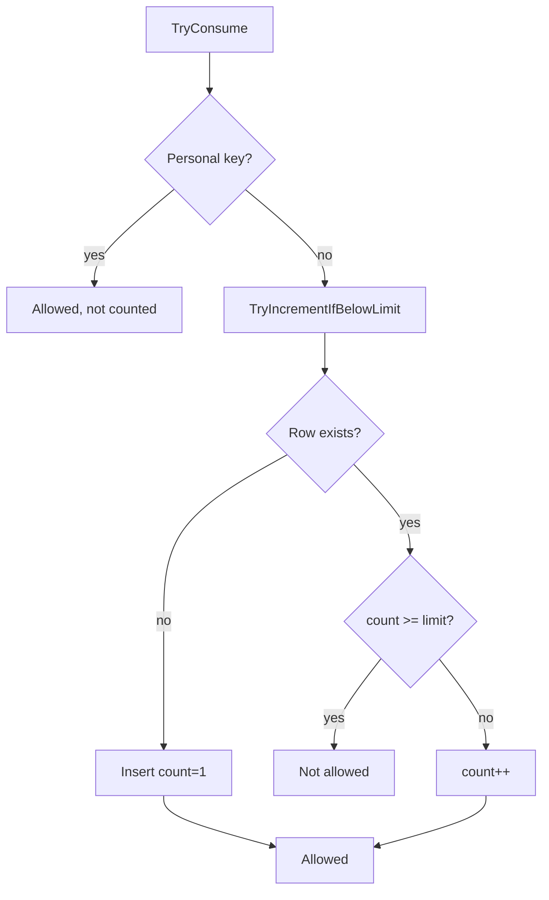

# Feature: AI Quota (Freemium)

> Enforce a monthly free-usage limit on AI analyses; bypassed by a personal Gemini API key.

## Table of Contents

- [Business Purpose](#business-purpose)
- [User Roles](#user-roles)
- [Controllers](#controllers)
- [Services](#services)
- [Database Tables](#database-tables)
- [DTOs](#dtos)
- [APIs / Endpoints](#apis--endpoints)
- [Business Rules](#business-rules)
- [Sequence Diagram](#sequence-diagram)
- [Flow Chart](#flow-chart)
- [Validation](#validation)
- [Permissions](#permissions)
- [Related Modules](#related-modules)
- [Known Limitations](#known-limitations)

## Business Purpose

Control the cost of the shared Gemini API key by giving each user a fixed number of free AI analyses per month (default 20). Power users who supply their own Gemini key get unlimited use (and pay Google directly).

## User Roles

Authenticated User (quota is per user).

## Controllers

- Consumed by `JobController.Analyze` (`TryConsumeAsync`) and displayed by `ProfileController.Index` (`GetStatusAsync`).

## Services

- `AiQuotaService` (`IAiQuotaService`) — `GetStatusAsync`, `TryConsumeAsync`.
- Backed by `AiUsageRepository` — `GetCurrentMonthCountAsync`, `TryIncrementIfBelowLimitAsync`.

## Database Tables

- `AiUsages` (one row per user per `(Year, Month)`, unique index `IX_AiUsages_User_Year_Month`).

## DTOs

- `QuotaCheckResult(Allowed, Used, Limit, BypassedByPersonalKey)` with `Remaining`. Quota fields surfaced via `ProfileViewModel`.

## APIs / Endpoints

- No dedicated endpoint; invoked inside `POST /Job/Analyze` and `GET /Profile`.

## Business Rules

- Limit = `Ai:FreeQuotaPerMonth` (default 20).
- A non-empty `UserProfile.PersonalGeminiApiKey` → unlimited (`Limit = int.MaxValue`, usage not counted, `BypassedByPersonalKey = true`).
- Quota is per **calendar month in UTC** (`Year`+`Month`); rolls over automatically via a new row.
- `TryConsumeAsync` increments atomically **only if** below limit; returns `Allowed=false` when reached.

## Sequence Diagram

## Flow Chart

## Validation

None at the model level; enforcement is the atomic DB increment + retry loop (up to 3 attempts) guarded by the unique index. See [06-data-access.md](../06-data-access.md#9-concurrency-handling).

## Permissions

`[Authorize]` on the consuming controllers; quota keyed by the authenticated user id.

## Related Modules

[AI Apply](AiApply.md) (consumer), [Profile](Profile.md) (displays status, holds personal key).

## Known Limitations

- **Quota is consumed even if the subsequent AI call fails** (no refund on error).
- Increment path relies on `DbUpdateConcurrencyException` but `AiUsage` has **no concurrency token**, so under heavy contention a lost update is theoretically possible.
- Only AI analysis counts; email sends and searches are unmetered.
- Limit is global config, not per-user configurable.
