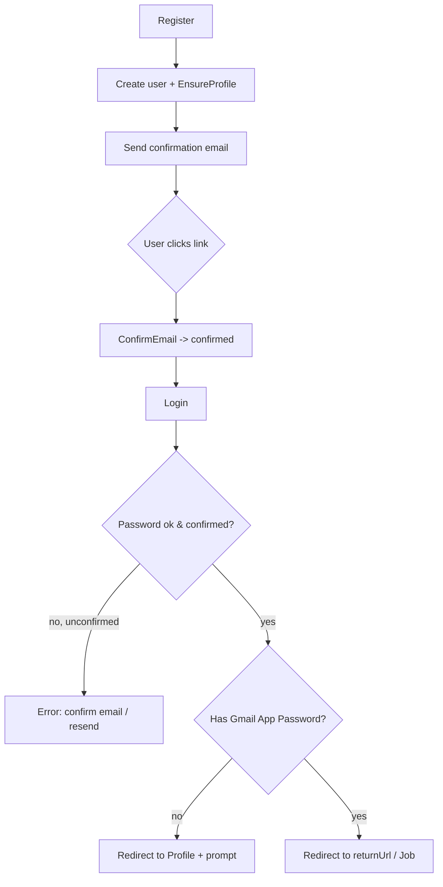

# Feature: Authentication & Account

> Registration, email confirmation, login/logout, password reset, optional Google login. Implemented with ASP.NET Core Identity Razor Pages.

## Table of Contents

- [Business Purpose](#business-purpose)
- [User Roles](#user-roles)
- [Controllers / Page Models](#controllers--page-models)
- [Services](#services)
- [Database Tables](#database-tables)
- [DTOs / Input Models](#dtos--input-models)
- [APIs / Endpoints](#apis--endpoints)
- [Business Rules](#business-rules)
- [Sequence Diagram](#sequence-diagram)
- [Flow Chart](#flow-chart)
- [Validation](#validation)
- [Permissions](#permissions)
- [Related Modules](#related-modules)
- [Known Limitations](#known-limitations)

## Business Purpose

Allow candidates to create and access a secure account. Email confirmation is mandatory before sign-in. On registration/login the app provisions a profile and nudges the user to configure their Gmail App Password so they can send applications.

## User Roles

- **Anonymous:** may register, login, confirm email, reset password.
- **Authenticated User:** everything else in the app.
- No roles are assigned or checked.

## Controllers / Page Models

- `HomeController.Index` — routes authenticated users to `/Job`, anonymous users to the landing page.
- Identity Razor Pages under `Areas/Identity/Pages/Account/`: `Register`, `RegisterConfirmation`, `ConfirmEmail`, `Login`, `Logout`, `ForgotPassword`, `ForgotPasswordConfirmation`, `ResetPassword`, `ResetPasswordConfirmation`, `ResendEmailConfirmation`.

## Services

- `UserAccountSetupService.EnsureProfileAsync` — creates/back-fills `UserProfile` on register & login.
- `IdentityEmailSender` (`IEmailSender<ApplicationUser>`) — sends confirmation/reset emails via `EmailSenderService` (global SMTP).
- Framework: `UserManager<ApplicationUser>`, `SignInManager<ApplicationUser>`.

## Database Tables

- `AspNetUsers` (+ other Identity tables), `UserProfiles` (created via account setup), `UserEmailCredentials` (read on login to decide the first-run prompt).

## DTOs / Input Models

- Per-page nested `InputModel`s (see [10-dtos.md](../10-dtos.md#14-identity-inputmodels)).

## APIs / Endpoints

See [04-api-reference.md](../04-api-reference.md#6-identity-razor-pages). Key: `POST /Identity/Account/Register`, `GET /Identity/Account/ConfirmEmail`, `POST /Identity/Account/Login`, `POST /Identity/Account/ForgotPassword`, `POST /Identity/Account/ResetPassword`.

## Business Rules

- Email confirmation required before sign-in (`RequireConfirmedAccount = true`).
- Unique email required; password ≥ 8 chars (no special-char requirement).
- `ForgotPassword` never reveals whether an email exists.
- On successful login, if the user has no saved Gmail App Password → redirect to Profile with a prompt.
- Sign-in has **no lockout** (`lockoutOnFailure: false`).

## Sequence Diagram

See [09-business-flows.md](../09-business-flows.md#7-register--confirm-email) and [#8](../09-business-flows.md#8-login-with-first-run-prompt). Token flows: [07-security.md](../07-security.md#11-token-flow).

## Flow Chart

## Validation

Data annotations on `InputModel`s (`[Required]`, `[EmailAddress]`, `[StringLength(MinimumLength=8)]`, `[Compare]`), plus Identity's own password/user validators.

## Permissions

All Identity pages `[AllowAnonymous]`. Post-auth features require `[Authorize]`.

## Related Modules

[Profile](Profile.md) (provisioned here), [AI Apply](AiApply.md) & [Bulk Apply](BulkApply.md) (require auth), [Email configuration](../08-configuration.md#7-smtp--email).

## Known Limitations

- No account lockout / brute-force protection.
- No 2FA UI wired (Identity 2FA pages not scaffolded; `RequiresTwoFactor` handled but page may be absent).
- Google login only if configured; otherwise unavailable.
- Confirmation/reset emails depend on global SMTP being configured, else they fail.
