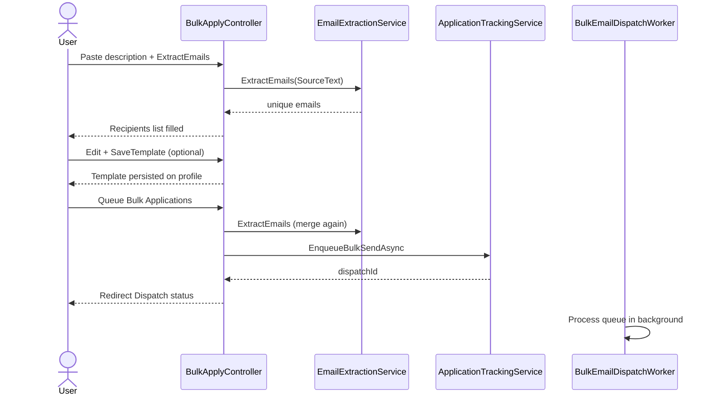
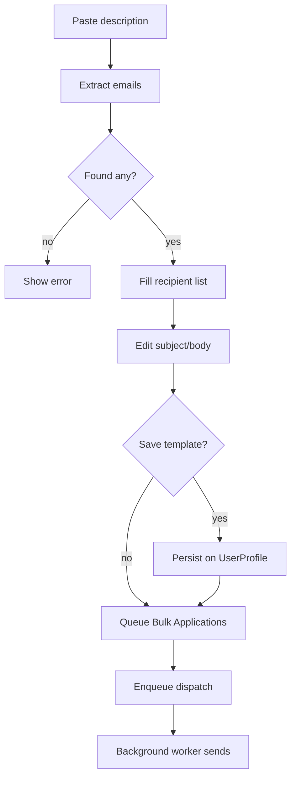

# Feature: Bulk Apply

> Send the same application email + CV to many recipients at once, from the user's own Gmail account. Recipients can be typed manually **or extracted from a pasted description** that contains many emails. The email subject/body are always editable and can be saved for reuse.

## Table of Contents

- [Business Purpose](#business-purpose)
- [User Roles](#user-roles)
- [Controllers](#controllers)
- [Services](#services)
- [Database Tables](#database-tables)
- [DTOs](#dtos)
- [APIs / Endpoints](#apis--endpoints)
- [Business Rules](#business-rules)
- [Sequence Diagram](#sequence-diagram)
- [Flow Chart](#flow-chart)
- [Validation](#validation)
- [Permissions](#permissions)
- [Related Modules](#related-modules)
- [Known Limitations](#known-limitations)

## Business Purpose

Let a candidate reach many hiring contacts quickly by emailing an application with the CV attached to up to 500 recipients, sent from the candidate's own Gmail so replies go to them.

Users can paste a job post / hiring note / any text containing emails; the app extracts all valid addresses and fills the recipient list.

Subject and body are always editable on the form. Users can **Save template** to persist them on their profile, or **Reset to default** to rebuild from profile title/skills/experience.

## User Roles

Authenticated User only.

## Controllers

- `BulkApplyController` (`[Authorize]`): `GET Index`, `POST ExtractEmails`, `POST SaveTemplate`, `POST ResetTemplate`, `POST Send`.
  - Deps: `IUserProfileRepository`, `IUserCvFileRepository`, `IUserEmailCredentialRepository`, `IApplicationTrackingService`, `IEmailExtractionService`.
- Helpers: `BuildViewModelAsync`, `ValidateRecipients`, `ValidateTemplate`, `ValidatePrerequisites`, `MergeRecipients`, `IsProfileComplete`, `BuildAutoSubject`, `BuildAutoBody`.

## Services

- `IEmailExtractionService` / `EmailExtractionService` — regex + validation extract unique emails from free-form text.
- `IApplicationTrackingService` — queues bulk dispatch for background processing.
- Background: `BulkEmailDispatchWorker` sends via per-user Gmail SMTP.
- `IUserProfileRepository.SaveBulkTemplateAsync` — persists `BulkTemplateSubject` / `BulkTemplateBody`.

## Database Tables

- `UserProfiles` (read + template write: `BulkTemplateSubject`, `BulkTemplateBody`), `UserCvFiles`, `UserEmailCredentials`, `BulkEmailDispatches` + `JobApplications`.

## DTOs

- `BulkApplyViewModel` includes `SourceText`, `Subject`, `Body`, `HasSavedTemplate`.
- See [10-dtos.md](../10-dtos.md#6-bulkapplyviewmodel--bulkapplysendresult).

## APIs / Endpoints

- `GET /BulkApply` — form prefilled with saved template (or profile default), prerequisite flags.
- `POST /BulkApply/ExtractEmails` — extract emails from `SourceText`, merge into recipient list, re-render Index.
- `POST /BulkApply/SaveTemplate` — save subject/body to the user profile for next visit.
- `POST /BulkApply/ResetTemplate` — clear saved template; next load uses profile-based default.
- `POST /BulkApply/Send` — merge recipients, validate, enqueue bulk dispatch using the form subject/body → redirect to Dispatch status.

## Business Rules

- **Prerequisites:** complete profile (FullName + Title + SkillsSummary + ExperienceSummary), CV on file, saved Gmail App Password.
- **Recipients:** 1–500, valid emails, duplicates removed (case-insensitive). Can come from manual inputs and/or `SourceText` extraction.
- **Extraction:** `EmailExtractionService` finds emails (including `mailto:`), strips trailing punctuation, validates, de-duplicates.
- **Template:** Subject and Body are always required on Send. Prefill order: saved profile template → else auto from profile. No Gemini call for bulk template.
- **Sender:** user's `UserEmailCredential`.
- **Queue:** send is asynchronous via `BulkEmailDispatches` / worker (not in-request). Enqueue commits dispatch + recipient rows in one DB transaction so the worker cannot complete early with zero pending apps.

## Sequence Diagram

## Flow Chart

## Validation

- Extract: empty/no emails → model error on `SourceText`.
- Save template: Subject + Body required; profile must exist.
- Send: recipients 1–50, valid emails; Subject + Body required; profile/CV/credential prerequisites.

## Permissions

`[Authorize]`; own credential/CV/profile only.

## Related Modules

[Profile](Profile.md), [AI Apply](AiApply.md), Applications dashboard / follow-ups.

## Known Limitations

- Max 500 recipients per queue.
- Extraction is regex-based (not AI); unusual formats may be missed.
- No per-recipient personalization in the email body.
- Gmail daily send limits still apply externally.
