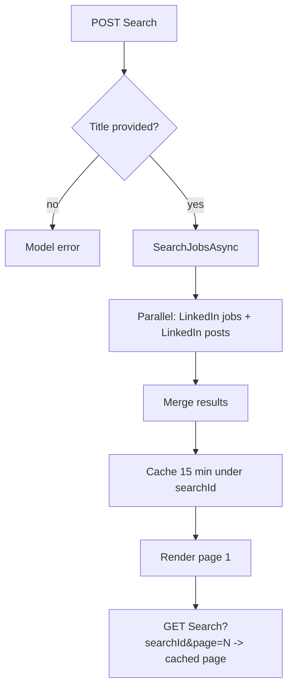

# Feature: Job Search

> Search LinkedIn job postings and LinkedIn "hiring" posts by title (location fixed to Egypt).

## Table of Contents

- [Business Purpose](#business-purpose)
- [User Roles](#user-roles)
- [Controllers](#controllers)
- [Services](#services)
- [Database Tables](#database-tables)
- [DTOs](#dtos)
- [APIs / Endpoints](#apis--endpoints)
- [Business Rules](#business-rules)
- [Sequence Diagram](#sequence-diagram)
- [Flow Chart](#flow-chart)
- [Validation](#validation)
- [Permissions](#permissions)
- [Related Modules](#related-modules)
- [Known Limitations](#known-limitations)

## Business Purpose

Help candidates discover openings without leaving the app by aggregating LinkedIn job cards and LinkedIn hiring posts for a given title in Egypt. Results can be fed into AI Apply.

## User Roles

Authenticated User only.

## Controllers

- `JobController` (`[Authorize]`): `GET Search`, `POST Search`. Uses `IJobScraperService` + `IMemoryCache`.

## Services

- `JobScraperService.SearchJobsAsync` → parallel `FetchLinkedInJobs` (LinkedIn guest API) + `FetchLinkedInPosts` (DuckDuckGo HTML).

## Database Tables

- **None.** Search does not touch the database. Results are cached in memory only.

## DTOs

- `JobSearchFilter`, `JobSearchResultItem`, `JobSearchViewModel` (with paging). See [10-dtos.md](../10-dtos.md).

## APIs / Endpoints

- `POST /Job/Search` — run a search, cache result 15 min under `{userId}:{guid}`.
- `GET /Job/Search?searchId&page` — page through cached results (10/page).

See [04-api-reference.md](../04-api-reference.md#3-jobcontroller).

## Business Rules

- `Title` is required.
- Location is hardcoded to **"Egypt"**.
- Optional LinkedIn filters: `ExperienceLevel` (`f_E`), `DatePosted` (`f_TPR`).
- Results merged (jobs + posts); `ResultType` = `"Job"` or `"Post"`.
- Cache TTL 15 minutes; page size 10.

## Sequence Diagram

See [09-business-flows.md#4](../09-business-flows.md#4-job-search).

## Flow Chart

## Validation

Controller checks `Title` non-empty; scraping errors are swallowed (empty results).

## Permissions

`[Authorize]`; cache key namespaced by user id.

## Related Modules

[AI Apply](AiApply.md) (paste a found URL to generate an application).

## Known Limitations

- **Fragile scraping:** depends on LinkedIn/DuckDuckGo HTML/markup and rate limits; failures return empty silently.
- Location fixed to Egypt (not user-configurable).
- No persistence/favorites; results vanish when the cache entry expires.
- In-memory cache is per-instance (not shared across scaled-out nodes).
- May violate third-party sites' terms of service (scraping) — operational/legal risk.
