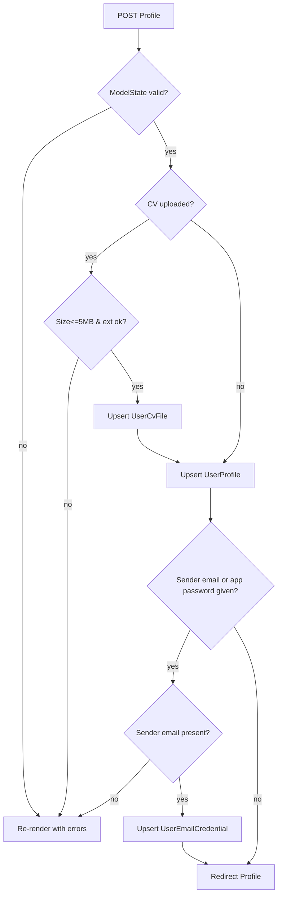

# Feature: Profile

> Manage candidate details, CV file, personal Gemini API key, and Gmail sender credential.

## Table of Contents

- [Business Purpose](#business-purpose)
- [User Roles](#user-roles)
- [Controllers](#controllers)
- [Services](#services)
- [Database Tables](#database-tables)
- [DTOs](#dtos)
- [APIs / Endpoints](#apis--endpoints)
- [Business Rules](#business-rules)
- [Sequence Diagram](#sequence-diagram)
- [Flow Chart](#flow-chart)
- [Validation](#validation)
- [Permissions](#permissions)
- [Related Modules](#related-modules)
- [Known Limitations](#known-limitations)

## Business Purpose

The profile is the single source of candidate data reused by every feature: name/title/skills/experience feed AI email generation and auto templates; the CV is attached to outgoing emails; the personal Gemini key bypasses the free quota; the Gmail credential enables bulk sending from the user's own address.

## User Roles

Authenticated User only (own profile). No admin view.

## Controllers

- `ProfileController` (`[Authorize]`): `GET/POST Index`, `GET Cv`, `POST FillFromCv`, `POST RewriteExperience`.
  - Deps: `IUserProfileRepository`, `IUserCvFileRepository`, `IUserEmailCredentialRepository`, `IAiQuotaService`, `IAiService`, `ICvTextExtractionService`, `UserManager<ApplicationUser>`.

## Services

- Repositories (profile, CV, credential) for persistence.
- `AiQuotaService` for quota display and consume on FillFromCv / RewriteExperience.
- `CvTextExtractionService` — extract plain text from PDF/DOCX.
- `IAiService.ExtractProfileFromCvAsync` — AI fills skills/experience (and empty name/title/phone/email); experience is forced to first person.
- `IAiService.RewriteInFirstPersonAsync` — rewrites saved experience text to first person (I / my).

## Database Tables

- `UserProfiles` (write/read), `UserCvFiles` (write/read + metadata), `UserEmailCredentials` (write/read), `AiUsages` (read/write via quota), `AspNetUsers` (read email).

## DTOs

- `ProfileViewModel` — see [10-dtos.md](../10-dtos.md#5-profileviewmodel). Metadata record `CvFileMetadata`.
- `CvProfileExtractionResult` — AI extraction output.

## APIs / Endpoints

- `GET /Profile` — render form with current values, CV metadata, quota status.
- `POST /Profile` — upsert profile, CV, credential (PRG on success).
- `GET /Profile/Cv` — download stored CV (`private, no-store`) or 404.
- `POST /Profile/FillFromCv` — extract CV text → AI fills skills/experience in first person → save profile → redirect.
- `POST /Profile/RewriteExperience` — rewrite existing Experience Summary into first person (no CV re-read) → save → redirect.

See [04-api-reference.md](../04-api-reference.md#5-profilecontroller).

## Business Rules

- `FullName` required; string-length caps per field.
- CV upload: `.pdf/.doc/.docx`, ≤ 5 MB; stored in `UserCvFiles.Content` (`varbinary(max)`).
- **FillFromCv** requires an uploaded CV; PDF/DOCX preferred (`.doc` not supported for text extraction).
- FillFromCv / RewriteExperience each consume **1 AI quota** (unless personal Gemini key).
- Experience Summary must be first person (`I` / `my`); FillFromCv and RewriteExperience rewrite third-person text.
- FillFromCv overwrites SkillsSummary/ExperienceSummary when AI returns values; only fills FullName/Title/Phone/ContactEmail when those profile fields are currently empty.
- Gmail App Password can only be saved together with a `SenderEmail` (else validation error).
- `SenderName` defaults to `FullName` when empty.
- `PersonalGeminiApiKey` and Gmail `Secret` stored **encrypted**; empty submitted value clears to null; unchanged (null) keeps existing.
- Credential defaults: `Provider=GmailSmtp`, `SmtpHost=smtp.gmail.com`, `SmtpPort=587`, `UseStartTls=true`.

## Sequence Diagram

See [09-business-flows.md](../09-business-flows.md#5-save-profile--cv--credentials) and [#6 Download CV](../09-business-flows.md#6-download-cv).

## Flow Chart

## Validation

Data annotations on `ProfileViewModel` + imperative CV checks + conditional sender-email requirement in `ProfileController`.

## Permissions

`[Authorize]`; strictly own data via `ClaimTypes.NameIdentifier`.

## Related Modules

Feeds [AI Apply](AiApply.md), [Bulk Apply](BulkApply.md), [AI Quota](AiQuota.md); provisioned by [Authentication](Authentication.md).

## Known Limitations

- The three upserts (CV, profile, credential) are **not** in one transaction; a mid-way failure can persist partial changes.
- No CV delete button surfaced via controller action for the user (repository `DeleteAsync` exists but is not exposed by a `[HttpPost]` action).
- No content-type sniffing/AV scanning of uploaded CVs (extension + size only).
